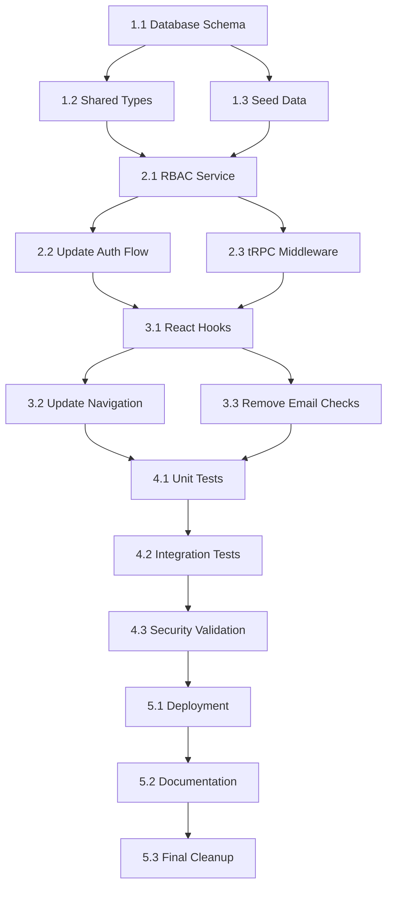

# RBAC SSOT Implementation Tasks

**Feature:** RBAC Single Source of Truth  
**Branch:** `feature/rbac-ssot-implementation`  
**Spec:** `/docs/plans/rbac-ssot-implementation-plan.md`  
**Analysis:** `/docs/analysis/rbac-current-state-analysis.md`  
**Research:** `/docs/research/rbac-best-practices.md`

---

## Task Dependencies



---

## Phase 1: Foundation

### Task 1.1: Database Schema

**Priority:** P0 (Critical)  
**Estimate:** 4 hours  
**Dependencies:** None  
**Status:** ⏳ Pending

**Description:**  
Create 4 new RBAC tables in the database schema following NIST RBAC model.

**Files to Create:**

- `/packages/database/src/schema/rbac/roles.ts`
- `/packages/database/src/schema/rbac/permissions.ts`
- `/packages/database/src/schema/rbac/user-roles.ts`
- `/packages/database/src/schema/rbac/role-permissions.ts`

**Files to Update:**

- `/packages/database/src/schema/index.ts`

**Implementation Steps:**

1. Create `roles` table with tenant scoping
2. Create `permissions` table with resource-action pairs
3. Create `user_roles` junction table
4. Create `role_permissions` junction table
5. Export all tables from schema index
6. Run `pnpm db:generate` to generate types
7. Verify type inference working

**Acceptance Criteria:**

- [ ] All 4 tables defined with proper Drizzle schema
- [ ] Foreign key constraints to users and tenants tables
- [ ] Unique constraints on (tenant_id, name) for roles
- [ ] Unique constraints on (resource, action) for permissions
- [ ] Schema exported from `/packages/database/src/schema/index.ts`
- [ ] Database types generated successfully
- [ ] No TypeScript errors

**Test Evidence:**

```bash
# Verify schema compiles
pnpm db:generate

# Verify no type errors
pnpm typecheck
```

---

### Task 1.2: Shared Type Definitions

**Priority:** P0 (Critical)  
**Estimate:** 3 hours  
**Dependencies:** Task 1.1 Complete  
**Status:** ⏳ Pending

**Description:**  
Create type-safe permission and role definitions in shared types package.

**Files to Create:**

- `/packages/types/src/rbac.ts`

**Files to Update:**

- `/packages/types/src/auth.ts`

**Implementation Steps:**

1. Define PERMISSIONS constant with all permission strings
2. Create Permission type from PERMISSIONS values
3. Define SystemRole union type
4. Define Role type (SystemRole | CustomRole)
5. Create Zod schemas for RBAC entities
6. Update auth types to reference Role type

**Acceptance Criteria:**

- [ ] All permissions defined as const assertions
- [ ] Permission type inferred (no `any`)
- [ ] Role types properly defined
- [ ] Zod schemas for API validation
- [ ] Auth schemas updated to use Role type
- [ ] All type tests passing

**Test Evidence:**

```bash
# Verify types compile
cd packages/types && pnpm typecheck

# Run type tests
pnpm test --filter @agenticverdict/types
```

---

### Task 1.3: Seed Data

**Priority:** P0 (Critical)  
**Estimate:** 3 hours  
**Dependencies:** Task 1.1, 1.2 Complete  
**Status:** ⏳ Pending

**Description:**  
Create seed data for system roles and permissions.

**Files to Create:**

- `/packages/database/src/seeds/rbac-seed.ts`

**Files to Update:**

- `/packages/database/scripts/seed.ts`

**Implementation Steps:**

1. Create seed function for system permissions
2. Create seed function for system roles (admin, analyst, editor, viewer)
3. Create role-permission mappings
4. Ensure idempotency (can run multiple times safely)
5. Integrate into main seed script
6. Test seed script on fresh database

**Acceptance Criteria:**

- [ ] All system permissions seeded (from PERMISSIONS constant)
- [ ] All system roles seeded (admin, analyst, editor, viewer)
- [ ] Role-permission mappings created correctly
- [ ] Seed script is idempotent
- [ ] Seed integrated into main seed script
- [ ] Seed tests passing

**Test Evidence:**

```bash
# Reset and seed database
pnpm db:reset
pnpm db:seed

# Verify seed data
psql -c "SELECT COUNT(*) FROM permissions;"
psql -c "SELECT COUNT(*) FROM roles;"
psql -c "SELECT COUNT(*) FROM role_permissions;"
```

---

## Phase 2: Backend Implementation

### Task 2.1: RBAC Service Layer

**Priority:** P0 (Critical)  
**Estimate:** 6 hours  
**Dependencies:** Task 1.1, 1.2, 1.3 Complete  
**Status:** ⏳ Pending

**Description:**  
Create RBAC service for database role and permission lookups.

**Files to Create:**

- `/packages/database/src/rbac-service.ts`
- `/packages/database/src/rbac-service.test.ts`

**Implementation Steps:**

1. Create RBACService class
2. Implement `getUserRoles(userId, tenantId)` method
3. Implement `getUserPermissions(userId, tenantId)` method
4. Implement `hasPermission(userId, tenantId, permission)` method
5. Implement `assignRole(userId, roleId, grantedBy)` method
6. Implement `revokeRole(userId, roleId)` method
7. Use `dbScoped` pattern for all queries
8. Write unit tests for all methods
9. Write integration tests

**Acceptance Criteria:**

- [ ] All service methods implemented
- [ ] `dbScoped` pattern used for tenant isolation
- [ ] Tenant context validated in all methods
- [ ] Unit tests with 100% coverage
- [ ] Integration tests with test database
- [ ] No TypeScript errors
- [ ] No `any` types

**Test Evidence:**

```bash
# Run RBAC service tests
pnpm test --filter @agenticverdict/database -- rbac-service

# Verify coverage
pnpm test:coverage --filter @agenticverdict/database
```

---

### Task 2.2: Update Auth Flow

**Priority:** P0 (Critical)  
**Estimate:** 4 hours  
**Dependencies:** Task 2.1 Complete  
**Status:** ⏳ Pending

**Description:**  
Replace email-based role resolution with database lookups in auth flow.

**Files to Update:**

- `/apps/api/src/trpc/routers/auth.ts`

**Implementation Steps:**

1. Remove `resolveUserRoles(email)` function (lines 50-55)
2. Create async `resolveUserRoles(userId, tenantId)` using RBAC service
3. Update `mapUserRow()` to async and call database role resolution
4. Update `getSession` query to await async role resolution
5. Update `login` mutation to use database roles for JWT
6. Update all auth tests

**Acceptance Criteria:**

- [ ] Zero email-based role resolution
- [ ] All role lookups use database via RBAC service
- [ ] Type safety maintained (no `any`)
- [ ] Auth tests passing
- [ ] Login flow tested end-to-end
- [ ] Session includes database roles

**Test Evidence:**

```bash
# Verify no email checks remain
grep -n "endsWith.*@agenticverdict.com" apps/api/src/trpc/routers/auth.ts
# Should return no results

# Run auth tests
pnpm test --filter @agenticverdict/api -- auth
```

---

### Task 2.3: tRPC RBAC Middleware

**Priority:** P1 (High)  
**Estimate:** 3 hours  
**Dependencies:** Task 2.1 Complete  
**Status:** ⏳ Pending

**Description:**  
Create tRPC middleware guards for permission and role-based access control.

**Files to Create:**

- `/apps/api/src/trpc/middleware/rbac-guard.ts`
- `/apps/api/src/trpc/middleware/rbac-guard.test.ts`

**Files to Update:**

- `/apps/api/src/trpc/middleware/index.ts`

**Implementation Steps:**

1. Create `requirePermission(permission)` middleware
2. Create `requireRole(role)` middleware
3. Export from middleware index
4. Write unit tests for middleware
5. Test with sample tRPC procedures

**Acceptance Criteria:**

- [ ] Permission guard middleware implemented
- [ ] Role guard middleware implemented
- [ ] Type-safe permission parameter
- [ ] Proper TRPCError on failure
- [ ] Middleware tests passing
- [ ] Example usage documented

**Test Evidence:**

```bash
# Run middleware tests
pnpm test --filter @agenticverdict/api -- rbac-guard

# Verify middleware exported
grep -n "requirePermission" apps/api/src/trpc/middleware/index.ts
```

---

## Phase 3: Frontend Integration

### Task 3.1: React Permission Hooks

**Priority:** P1 (High)  
**Estimate:** 4 hours  
**Dependencies:** Task 2.2 Complete  
**Status:** ⏳ Pending

**Description:**  
Create React hooks for permission and role checking in frontend components.

**Files to Create:**

- `/apps/frontend/src/features/rbac/hooks/usePermissions.ts`
- `/apps/frontend/src/features/rbac/hooks/useRoles.ts`
- `/apps/frontend/src/features/rbac/hooks/useCanAccess.ts`
- `/apps/frontend/src/features/rbac/hooks/index.ts`
- `/apps/frontend/src/features/rbac/hooks/usePermissions.test.ts`

**Implementation Steps:**

1. Create `usePermissions()` hook with permission checking methods
2. Create `useRoles()` hook with role checking methods
3. Create `useCanAccess()` hook for combined checks
4. Export all hooks from index
5. Write unit tests for all hooks
6. Test with mock auth store

**Acceptance Criteria:**

- [ ] All hooks implemented
- [ ] Type-safe permission checking
- [ ] Memoized for performance
- [ ] Hook tests passing
- [ ] No `any` types
- [ ] Exported from features/rbac/hooks

**Test Evidence:**

```bash
# Run hook tests
pnpm test --filter @agenticverdict/frontend -- usePermissions

# Verify hooks exported
grep -n "export" apps/frontend/src/features/rbac/hooks/index.ts
```

---

### Task 3.2: Update Navigation Components

**Priority:** P1 (High)  
**Estimate:** 3 hours  
**Dependencies:** Task 3.1 Complete  
**Status:** ⏳ Pending

**Description:**  
Update navigation components to use shared RBAC types and permission-based filtering.

**Files to Update:**

- `/apps/frontend/src/components/layout/app-shell-navigation.ts`
- `/apps/frontend/src/components/layout/app-shell-navigation.test.ts`

**Implementation Steps:**

1. Import shared Role type from `@agenticverdict/types`
2. Update `AppShellNavRole` type to use shared type
3. Add `requiredPermissions` field to navigation items
4. Update `filterAppShellNavItems()` to check permissions first
5. Maintain backward compatibility with role-based filtering
6. Update navigation tests

**Acceptance Criteria:**

- [ ] Navigation uses shared Role type
- [ ] Permission-based filtering implemented
- [ ] Role-based filtering still works (backward compat)
- [ ] Navigation tests passing
- [ ] Type safety maintained

**Test Evidence:**

```bash
# Run navigation tests
pnpm test --filter @agenticverdict/frontend -- app-shell-navigation

# Verify type imports
grep -n "import.*Role.*from.*@agenticverdict/types" apps/frontend/src/components/layout/app-shell-navigation.ts
```

---

### Task 3.3: Remove Email-Based Checks

**Priority:** P1 (High)  
**Estimate:** 4 hours  
**Dependencies:** Task 3.1 Complete  
**Status:** ⏳ Pending

**Description:**  
Remove all email-based authorization checks and replace with RBAC hooks.

**Files to Update:**

- `/apps/frontend/src/components/layout/AppShellLayout.tsx`
- `/apps/frontend/src/components/layout/AppNavigation.tsx`
- `/apps/frontend/src/features/dashboard/ui/surfaces/dashboard-permissions.ts`
- `/apps/frontend/src/lib/api/auth-api.ts`

**Implementation Steps:**

1. Update `AppShellLayout.tsx` to use `useRoles()` hook
2. Update `AppNavigation.tsx` to use `useRoles()` hook
3. Update `dashboard-permissions.ts` to use `usePermissions()` hook
4. Update `auth-api.ts` mock to remove email-based role check
5. Update all affected component tests
6. Manual testing of navigation and permissions

**Acceptance Criteria:**

- [ ] Zero `endsWith("@agenticverdict.com")` patterns in frontend
- [ ] All components use RBAC hooks
- [ ] All tests updated and passing
- [ ] Manual testing confirms navigation works
- [ ] Manual testing confirms permissions work

**Test Evidence:**

```bash
# CRITICAL: Verify no email checks remain
grep -rn "endsWith.*@agenticverdict.com" apps/frontend/
# MUST return no results

# Run frontend tests
pnpm test --filter @agenticverdict/frontend
```

---

## Phase 4: Testing & Validation

### Task 4.1: Unit Tests

**Priority:** P1 (High)  
**Estimate:** 4 hours  
**Dependencies:** Task 3.3 Complete  
**Status:** ⏳ Pending

**Description:**  
Ensure comprehensive unit test coverage for all RBAC components.

**Files to Create/Update:**

- All test files for RBAC components

**Implementation Steps:**

1. Verify RBAC service tests (100% coverage)
2. Verify permission hook tests (100% coverage)
3. Verify middleware guard tests (100% coverage)
4. Run type tests for RBAC types
5. Fix any failing tests
6. Generate coverage report

**Acceptance Criteria:**

- [ ] RBAC service: 100% coverage
- [ ] Permission hooks: 100% coverage
- [ ] Middleware guards: 100% coverage
- [ ] Type tests passing
- [ ] Overall coverage > 90%

**Test Evidence:**

```bash
# Run all tests with coverage
pnpm test:coverage

# Generate coverage report
pnpm test:coverage:report
```

---

### Task 4.2: Integration Tests

**Priority:** P1 (High)  
**Estimate:** 4 hours  
**Dependencies:** Task 4.1 Complete  
**Status:** ⏳ Pending

**Description:**  
Test RBAC system end-to-end with database and frontend integration.

**Files to Create:**

- `/apps/api/test/integration/rbac.integration.test.ts`
- `/apps/frontend/test/integration/rbac-flow.test.ts`

**Implementation Steps:**

1. Test user login with database roles
2. Test role assignment and revocation
3. Test permission-based API access
4. Test multi-tenant isolation
5. Test JWT role refresh
6. Test frontend permission flows

**Acceptance Criteria:**

- [ ] Login flow test passing
- [ ] Role management test passing
- [ ] Permission check test passing
- [ ] Tenant isolation test passing
- [ ] Frontend flow test passing
- [ ] All integration tests passing

**Test Evidence:**

```bash
# Run integration tests
pnpm test:integration

# Verify all pass
pnpm test:integration --reporter=verbose
```

---

### Task 4.3: Security Validation

**Priority:** P1 (High)  
**Estimate:** 2 hours  
**Dependencies:** Task 4.2 Complete  
**Status:** ⏳ Pending

**Description:**  
Validate security of RBAC implementation and verify no vulnerabilities remain.

**Implementation Steps:**

1. Grep for remaining email-based checks
2. Verify all queries include tenant_id
3. Validate RLS policies enforced
4. Check for privilege escalation vectors
5. Verify audit logging working
6. Security code review

**Acceptance Criteria:**

- [ ] Zero email-based checks in codebase
- [ ] All DB queries include tenant_id filter
- [ ] RLS policies configured and tested
- [ ] No privilege escalation vectors found
- [ ] Audit logging captures role changes
- [ ] Security review completed

**Test Evidence:**

```bash
# CRITICAL: Verify no email checks anywhere
grep -rn "endsWith.*@agenticverdict.com" apps/ packages/
# MUST return no results

# Verify tenant scoping
grep -rn "tenantId" packages/database/src/rbac-service.ts
# Should show tenant validation in all methods
```

---

## Phase 5: Deployment & Cleanup

### Task 5.1: Database Migration

**Priority:** P2 (Medium)  
**Estimate:** 1 hour  
**Dependencies:** Task 4.3 Complete  
**Status:** ⏳ Pending

**Description:**  
Deploy RBAC schema and seed data to database.

**Files to Update:**

- None (greenfield - no migration needed)

**Implementation Steps:**

1. Run `pnpm db:generate` to generate types
2. Run `pnpm db:push` to push schema
3. Run `pnpm db:seed` to seed data
4. Verify tables created
5. Verify seed data present

**Acceptance Criteria:**

- [ ] Database schema pushed successfully
- [ ] All 4 RBAC tables created
- [ ] Seed data inserted
- [ ] No errors in migration

**Test Evidence:**

```bash
# Push schema
pnpm db:push

# Seed data
pnpm db:seed

# Verify tables
psql -c "\dt" | grep -E "roles|permissions|user_roles|role_permissions"

# Verify seed data
psql -c "SELECT COUNT(*) FROM permissions;"
psql -c "SELECT COUNT(*) FROM roles;"
```

---

### Task 5.2: Documentation

**Priority:** P2 (Medium)  
**Estimate:** 2 hours  
**Dependencies:** Task 5.1 Complete  
**Status:** ⏳ Pending

**Description:**  
Update documentation for RBAC system.

**Files to Create:**

- `/docs/architecture/rbac-architecture.md`
- `/docs/guides/role-management.md`

**Implementation Steps:**

1. Document RBAC architecture
2. Document role management guide for admins
3. Document permission taxonomy
4. Update API documentation
5. Add examples and use cases

**Acceptance Criteria:**

- [ ] Architecture document created
- [ ] Role management guide created
- [ ] Permission taxonomy documented
- [ ] API docs updated
- [ ] Examples provided

---

### Task 5.3: Final Cleanup

**Priority:** P2 (Medium)  
**Estimate:** 2 hours  
**Dependencies:** Task 5.2 Complete  
**Status:** ⏳ Pending

**Description:**  
Final verification and cleanup before merging to main.

**Implementation Steps:**

1. Run full test suite
2. Run typecheck
3. Run lint
4. Verify no email checks remain
5. Update CHANGELOG
6. Create PR

**Acceptance Criteria:**

- [ ] All tests passing
- [ ] Typecheck passing
- [ ] Lint passing
- [ ] Zero email-based checks
- [ ] CHANGELOG updated
- [ ] PR created and reviewed

**Test Evidence:**

```bash
# Final verification
pnpm test
pnpm typecheck
pnpm lint

# CRITICAL: Final email check verification
grep -rn "endsWith.*@agenticverdict.com" .
# MUST return no results (except in this tasks.md file)

# Create PR
gh pr create --title "feat: RBAC SSOT implementation" --body "Implements database-driven RBAC system"
```

---

## Definition of Done

A task is considered complete when:

- [ ] Implementation code written
- [ ] Unit tests passing
- [ ] Type safety verified (no `any`)
- [ ] Multi-tenant safe (tenant context validated)
- [ ] No sensitive data in logs
- [ ] Documentation updated (if applicable)
- [ ] Code reviewed (if applicable)

---

## Progress Tracking

| Phase               | Tasks  | Complete | In Progress | Pending |
| ------------------- | ------ | -------- | ----------- | ------- |
| Phase 1: Foundation | 3      | 0        | 0           | 3       |
| Phase 2: Backend    | 3      | 0        | 0           | 3       |
| Phase 3: Frontend   | 3      | 0        | 0           | 3       |
| Phase 4: Testing    | 3      | 0        | 0           | 3       |
| Phase 5: Deployment | 3      | 0        | 0           | 3       |
| **Total**           | **15** | **0**    | **0**       | **15**  |

---

**Last Updated:** 2026-04-30  
**Next Action:** Begin Task 1.1 (Database Schema)
