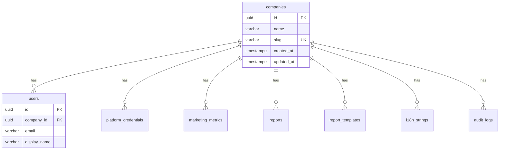

# Changelog entry: Execution Phase 3 (database layer and tenant-scoped access)

**Date:** 2026-04-04  
**Scope:** Phase 0 — [Execution Phase 3 — Database layer and tenant-scoped data access](specs/00-core/00-foundation/EXECUTION-PLAN.md) (`tasks.md` §3: 0.23–0.33).

This entry records Drizzle/PostgreSQL schema, initial migration with row-level security, connection helpers, optional Upstash Redis, seeds, and RLS-focused integration tests.

---

## Summary

- Defined **eight tables** aligned with acceptance criteria §3: `companies`, `users`, `platform_credentials`, `marketing_metrics`, `reports`, `report_templates`, `i18n_strings`, `audit_logs`, each tenant-scoped via `company_id` (except `companies`, keyed by `id`).
- Added **`migrations/0000_initial_schema.sql`** (Drizzle-generated DDL plus **ENABLE/FORCE RLS** and per-table policies using `current_setting('app.current_tenant_id', true)::uuid`).
- Extended **`createDatabaseClient`** with pool size, connect/idle timeouts, **30s `statement_timeout`**, and optional Drizzle SQL debug logging; added **`waitForDatabase`** (exponential backoff) and **`pingDatabase`**.
- Exported **`runMigrations`** / **`migrationsFolder`** for programmatic migrate; **`createUpstashRedisFromEnv`** when `UPSTASH_REDIS_REST_URL` + `UPSTASH_REDIS_REST_TOKEN` are set.
- **`pnpm run db:seed`** reads `configs/companies/*.json` (or `COMPANY_CONFIG_DIR`), runs migrations, upserts companies by `companyId`.
- **`dbScoped`** continues to set `app.current_tenant_id` inside a transaction using `@agenticverdict/core` tenant context.
- **Integration tests** (`test/rls.integration.test.ts`) use Testcontainers PostgreSQL 16 and a **non-superuser** role to assert cross-tenant reads/inserts are blocked; default `pnpm test` runs a small unit test only — use **`pnpm run test:integration`** in `packages/database` when Docker is available.

---

## Schema ERD (Phase 0)

---

## Migrations and rollback

- **Apply (CLI):** `pnpm --filter @agenticverdict/database run db:migrate` with `DATABASE_URL` set (uses `drizzle-kit migrate` against the journal under `migrations/meta`).
- **Apply (code):** `import { runMigrations } from "@agenticverdict/database"` then `await runMigrations(connectionString)` (migration-capable role).
- **Rollback:** Drizzle does not emit automatic down migrations. To roll back this baseline in a dev database, drop dependent objects in reverse dependency order (or `DROP SCHEMA public CASCADE` in a disposable environment) and re-apply from scratch. Record any production rollback as a new forward migration when Phase 1+ requires it.

---

## Environment variables

| Variable                                              | Purpose                                                                                       |
| ----------------------------------------------------- | --------------------------------------------------------------------------------------------- |
| `DATABASE_URL`                                        | PostgreSQL connection string (seeds, migrate, app)                                            |
| `COMPANY_CONFIG_DIR`                                  | Optional override for company JSON directory used by `db:seed`                                |
| `UPSTASH_REDIS_REST_URL` / `UPSTASH_REDIS_REST_TOKEN` | When both set, `createUpstashRedisFromEnv()` returns an Upstash REST client; otherwise `null` |

---

## Verification (local)

- `pnpm --filter @agenticverdict/database run test`
- `pnpm --filter @agenticverdict/database run test:integration` (requires Docker)
- `pnpm exec turbo run build lint test typecheck`
- `pnpm run format:check` and `pnpm run check:cycles`

---

## Follow-ups (not in this change set)

- **Acceptance §3** asks for query performance monitoring and slow-query logging in-app; current baseline relies on PostgreSQL `statement_timeout` and optional SQL debug logging.
- **Coverage targets** (85% models/utilities) are not fully met across all new modules; expand unit tests around `client.ts` helpers if CI gates require it.
- **CI job** to run `test:integration` with a Docker service is deferred to Execution Phase 6.

---

## Related documentation

- [`specs/00-core/00-foundation/EXECUTION-PLAN.md`](specs/00-core/00-foundation/EXECUTION-PLAN.md) — Execution Phase 3 definition.
- [`specs/00-core/00-foundation/tasks.md`](specs/00-core/00-foundation/tasks.md) — tasks 0.23–0.33 (marked Done).
- [`specs/00-core/00-foundation/acceptance-criteria.md`](specs/00-core/00-foundation/acceptance-criteria.md) — §3 Database Layer.
