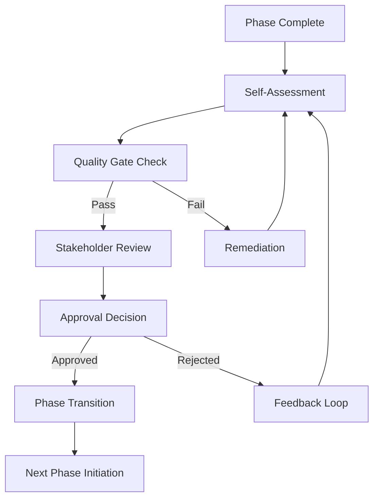

# Phase Transition Criteria for AgenticVerdict

## Document Information
- **Version**: 1.0
- **Last Updated**: 2026-04-03
- **Status**: Active
- **Owner**: Project Management Office

## 1. Overview

### Purpose
This document defines the standardized criteria, processes, and quality gates for transitioning between development phases in the AgenticVerdict project. It ensures consistent quality, reduces technical debt, and maintains project momentum.

### Scope
Applies to all phase transitions in the development roadmap, from Phase 0 (Foundation) through Phase 6 (Analytics & Reporting).

### Key Principles
- **Quality Over Speed**: Never compromise quality for artificial deadlines
- **Objective Criteria**: Use measurable, verifiable requirements
- **Stakeholder Alignment**: Ensure consensus before transitions
- **Risk Mitigation**: Identify and address potential issues early
- **Continuous Delivery**: Maintain deployable state throughout

## 2. Standard Phase Transition Process

### 2.1 Pre-Transition Checklist

**Initial Review** (1 week before target transition)
- [ ] Complete all planned features for the phase
- [ ] Meet minimum code coverage requirements
- [ ] Pass all automated tests
- [ ] Complete documentation updates
- [ ] Conduct security review
- [ ] Performance testing completed
- [ ] Stakeholder demonstration scheduled

**Final Review** (3 days before target transition)
- [ ] All critical bugs resolved
- [ ] All high-priority bugs addressed or deferred
- [ ] Documentation complete and reviewed
- [ ] Test coverage meets threshold
- [ ] Performance benchmarks met
- [ ] Security scan clean
- [ ] Rollback plan documented

**Go/No-Go Decision** (1 day before transition)
- [ ] All quality gates passed
- [ ] Stakeholder approval obtained
- [ ] Transition plan communicated
- [ ] Team capacity for next phase confirmed

### 2.2 Transition Process Flow



### 2.3 Role Responsibilities

**Phase Lead**
- Owns transition readiness
- Coordinates all reviews
- Presents transition case
- Documents lessons learned

**QA Lead**
- Verifies test coverage
- Validates test results
- Signs off on quality
- Identifies outstanding risks

**Tech Lead**
- Reviews code quality
- Validates architecture decisions
- Assesses technical debt
- Approves technical aspects

**Product Manager**
- Validates feature completeness
- Confirms business value
- Assesses user impact
- Provides business sign-off

**Project Manager**
- Facilitates process
- Tracks transition criteria
- Manages stakeholder expectations
- Documents decisions

## 3. Quality Gates by Phase

### Phase 0: Foundation → Phase 1

#### Must Have (Blocking)
- **Infrastructure**: All services containerized and documented
- **Database**: Schema versioned, migrations tested
- **Authentication**: Local auth working, OAuth framework ready
- **Testing**: Unit test framework configured, CI pipeline running
- **Documentation**: Setup guide, API documentation skeleton
- **Code Coverage**: 70% for utilities, 60% overall

#### Should Have (Non-blocking but recommended)
- **Monitoring**: Basic logging and metrics
- **Error Handling**: Standardized error responses
- **API Standards**: OpenAPI specification for basic endpoints
- **Performance**: Baseline metrics established

#### Nice to Have
- **Development Tools**: Admin interfaces, debug tools
- **Documentation**: Architecture diagrams, decision logs

#### Rollback Criteria
- Critical infrastructure issues
- Security vulnerabilities
- Database migration failures

---

### Phase 1: Core Platform → Phase 2

#### Must Have (Blocking)
- **User Management**: Registration, login, profile management
- **Authentication**: Full OAuth support, token management
- **Authorization**: Role-based access control
- **API Surface**: All CRUD operations documented and tested
- **Data Validation**: Input validation on all endpoints
- **Error Handling**: Comprehensive error responses
- **Testing**: 80% coverage for business logic
- **Security**: Authentication tests passed, no critical vulnerabilities

#### Should Have (Non-blocking but recommended)
- **Email System**: Transactional emails working
- **File Upload**: Document upload/download
- **Audit Logging**: Critical actions logged
- **Performance**: API response times < 500ms (P95)
- **Documentation**: User guide, API documentation complete

#### Nice to Have
- **Advanced Features**: Two-factor authentication
- **Analytics**: Basic usage metrics

#### Rollback Criteria
- Authentication failures
- Data loss incidents
- Security breaches
- Performance degradation > 50%

---

### Phase 2: Single-Tenant → Phase 3

#### Must Have (Blocking)
- **Domain Features**: All dispute management features working
- **Platform Integration**: At least one platform fully integrated
- **Data Processing**: Order/customer data syncing
- **Report Generation**: Basic PDF reports working
- **User Workflows**: Complete end-to-end scenarios
- **Testing**: 85% coverage for domain logic
- **Documentation**: Complete user documentation
- **Performance**: Report generation < 30s for standard cases

#### Should Have (Non-blocking but recommended)
- **Advanced Features**: Bulk operations, advanced search
- **Notifications**: Email notifications for key events
- **Data Export**: CSV/Excel exports
- **Performance**: Support for 10,000+ transactions

#### Nice to Have
- **Mobile Support**: Responsive design complete
- **API Clients**: SDK for major languages

#### Rollback Criteria
- Data corruption in core workflows
- Critical business logic failures
- Performance issues preventing use
- Data loss incidents

---

### Phase 3: Multi-Tenant → Phase 4

#### Must Have (Blocking)
- **Tenant Isolation**: Complete data separation verified
- **Tenant Provisioning**: Automated signup and onboarding
- **Resource Management**: Fair resource allocation
- **Configuration**: Tenant-specific settings working
- **Security**: Cross-tenant access prevented
- **Testing**: 90% coverage for tenant logic
- **Performance**: No "noisy neighbor" effects under load
- **Documentation**: Multi-tenant deployment guide

#### Should Have (Non-blocking but recommended)
- **Billing Integration**: Metering and billing hooks
- **Tenant Admin**: Self-service management
- **Advanced Features**: Tenant templates
- **Monitoring**: Per-tenant metrics

#### Nice to Have
- **White Labeling**: Custom branding
- **Advanced Billing**: Automated invoicing

#### Rollback Criteria
- Cross-tenant data leakage
- Tenant provisioning failures
- Resource exhaustion affecting multiple tenants
- Security vulnerabilities in isolation

---

### Phase 4: AI Agent System → Phase 5

#### Must Have (Blocking)
- **Agent Framework**: Core agent system functional
- **Prompt Management**: Versioned prompts, testing framework
- **Fallback Mechanisms**: Graceful degradation on AI failures
- **Decision Logging**: All agent decisions logged
- **Human Oversight**: Escalation paths working
- **Testing**: 85% coverage for agent logic
- **Evaluation**: Response quality metrics established
- **Performance**: Agent response < 30s (P95)
- **Documentation**: Agent development guide

#### Should Have (Non-blocking but recommended)
- **Multiple Providers**: Support for 2+ AI providers
- **Cost Management**: Token usage tracking
- **Advanced Features**: Multi-step reasoning
- **Monitoring**: Agent performance dashboards

#### Nice to Have
- **Custom Agents**: User-defined agent behaviors
- **Fine-tuning**: Custom model support

#### Rollback Criteria
- Agent decision errors causing business impact
- Unacceptable response quality
- AI provider downtime without fallback
- Cost overruns without controls

---

### Phase 5: Platform Expansion → Phase 6

#### Must Have (Blocking)
- **Multiple Platforms**: At least 3 platforms fully integrated
- **Adapter Framework**: Standardized adapter pattern
- **Error Handling**: Platform-specific errors handled
- **Rate Limiting**: Proper backoff and queuing
- **Data Mapping**: Accurate field transformations
- **Testing**: 80% coverage per platform adapter
- **Documentation**: Integration guide for each platform
- **Performance**: Platform sync < 5min for 1000 records

#### Should Have (Non-blocking but recommended)
- **Universal Adapter**: Generic e-commerce support
- **Advanced Features**: Platform-specific optimizations
- **Monitoring**: Per-platform metrics
- **Webhooks**: Real-time event processing

#### Nice to Have
- **Custom Integrations**: Framework for custom adapters
- **API Marketplaces**: Public integration listings

#### Rollback Criteria
- Data corruption from platform integrations
- Critical platform sync failures
- Rate limiting causing data loss
- Security vulnerabilities in adapters

---

### Phase 6: Analytics & Reporting → Production

#### Must Have (Blocking)
- **Core Analytics**: All required metrics calculated
- **Advanced Reports**: Complex reports (trends, comparisons)
- **Dashboards**: Real-time monitoring dashboards
- **Scheduled Reports**: Automated report delivery
- **Data Pipeline**: Reliable ETL processes
- **Testing**: 85% coverage for analytics logic
- **Performance**: Dashboards load < 3s, reports < 30s
- **Documentation**: Complete system documentation

#### Should Have (Non-blocking but recommended)
- **Advanced Analytics**: Predictive analytics, ML models
- **Custom Reports**: User-defined report builder
- **Export Options**: Multiple format support
- **Data Warehousing**: Optimized analytics storage

#### Nice to Have
- **Real-time Analytics**: Streaming metrics
- **Advanced Visualizations**: Interactive charts

#### Rollback Criteria
- Data quality issues in analytics
- Report generation failures
- Performance preventing analytics use
- Data privacy violations

## 4. Approval Workflow

### 4.1 Approval Matrix

| Approval Required | Phase 0 | Phase 1 | Phase 2 | Phase 3 | Phase 4 | Phase 5 | Phase 6 |
|-------------------|---------|---------|---------|---------|---------|---------|---------|
| Tech Lead | ✓ | ✓ | ✓ | ✓ | ✓ | ✓ | ✓ |
| QA Lead | ✓ | ✓ | ✓ | ✓ | ✓ | ✓ | ✓ |
| Product Manager | | ✓ | ✓ | ✓ | ✓ | ✓ | ✓ |
| Security Team | | | | ✓ | ✓ | ✓ | ✓ |
| DevOps Lead | ✓ | ✓ | ✓ | ✓ | ✓ | ✓ | ✓ |
| Executive Team | | | | | | | ✓ |

### 4.2 Approval Process

**Step 1: Preparation** (Phase Lead)
- Complete transition checklist
- Prepare transition presentation
- Document metrics and achievements
- Identify outstanding issues

**Step 2: Technical Review** (Tech Lead + QA Lead)
- Review code quality and test coverage
- Validate architecture decisions
- Assess technical debt
- Performance and security review

**Step 3: Business Review** (Product Manager)
- Validate feature completeness
- Confirm business value delivered
- Assess user impact
- Review against business objectives

**Step 4: Risk Assessment** (All Approvers)
- Identify potential risks
- Assess mitigation strategies
- Review rollback plans
- Evaluate support readiness

**Step 5: Decision** (Project Manager)
- Gather all approvals
- Document decision rationale
- Communicate outcome
- Plan next steps

### 4.3 Approval Criteria

**Automatic Approval**
- All must-have criteria met
- No critical bugs
- Test coverage above threshold
- Performance benchmarks met
- Security scan clean

**Conditional Approval**
- Must-have criteria met
- Minor should-have items deferred
- Documented technical debt
- Plan for deferred items

**Rejection Reasons**
- Must-have criteria not met
- Critical bugs unresolved
- Security vulnerabilities
- Performance failures
- Insufficient test coverage
- Inadequate documentation

## 5. Sign-Off Requirements

### 5.1 Mandatory Sign-Offs

**Technical Sign-Off** (Tech Lead)
- Code quality acceptable
- Architecture decisions validated
- Technical debt documented
- Performance standards met

**Quality Sign-Off** (QA Lead)
- Test coverage meets requirements
- All test suites passing
- Quality metrics achieved
- Outstanding risks documented

**Security Sign-Off** (Security Team)
- Security review completed
- No critical vulnerabilities
- Compliance requirements met
- Security best practices followed

**Product Sign-Off** (Product Manager)
- Business requirements met
- User acceptance criteria passed
- Feature completeness validated
- Business value delivered

### 5.2 Sign-Off Artifacts

**Required Documentation**
- Completed transition checklist
- Test coverage report
- Performance metrics report
- Security scan results
- Known issues document
- Rollback plan
- Lessons learned document

**Optional Documentation**
- Architecture decision records
- Technical debt assessment
- User feedback summary
- Market analysis update

## 6. Rollback Criteria

### 6.1 Immediate Rollback Triggers

**Critical Issues**
- Data corruption or loss
- Security vulnerabilities with active exploits
- Complete system unavailability
- Authentication/authorization failures
- Legal or compliance violations

**Severe Performance Issues**
- Response times > 5x baseline
- Error rate > 10%
- Resource exhaustion
- Database deadlocks

### 6.2 Rollback Decision Process

**Initiation** (Any stakeholder)
- Identify critical issue
- Document impact
- Notify project manager
- Trigger emergency response

**Assessment** (Tech Lead + QA Lead)
- Verify issue severity
- Assess rollback complexity
- Evaluate forward fix options
- Recommend action

**Decision** (Project Manager)
- Make rollback decision
- Communicate to team
- Execute rollback plan
- Post-mortem scheduled

### 6.3 Rollback Execution

**Pre-Rollback**
- Document current state
- Notify all stakeholders
- Prepare rollback plan
- Set monitoring

**During Rollback**
- Execute rollback steps
- Verify system stability
- Monitor key metrics
- Update status

**Post-Rollback**
- System health verification
- Stakeholder communication
- Incident documentation
- Improvement planning

## 7. Metrics and Thresholds

### 7.1 Quality Metrics

**Code Quality**
- Code Coverage: ≥ Phase-specific threshold
- Cyclomatic Complexity: < 15 per function
- Code Duplication: < 5%
- Technical Debt Ratio: < 5%

**Test Quality**
- Test Pass Rate: 100%
- Flaky Test Rate: < 2%
- Test Execution Time: Within SLA
- Automated Test Ratio: ≥ Phase-specific threshold

**Performance**
- API Response Time: < Phase-specific threshold
- Error Rate: < 1%
- Throughput: Meet projected load
- Resource Utilization: < 80%

**Security**
- Critical Vulnerabilities: 0
- High Vulnerabilities: 0
- Medium Vulnerabilities: < 5
- Security Score: ≥ A

### 7.2 Progress Metrics

**Feature Completion**
- Planned Features Delivered: 100%
- Features with Known Issues: 0
- Deferred Features: Documented and approved

**Documentation**
- Required Documents: 100% complete
- Document Quality Score: ≥ 4/5
- Update Frequency: Within 24h of changes

**Stakeholder Satisfaction**
- Team Confidence: ≥ 4/5
- Stakeholder Approval: Obtained
- User Acceptance: Passed

### 7.3 Monitoring Requirements

**Real-Time Monitoring**
- System health dashboards
- Error rate tracking
- Performance metrics
- Resource utilization

**Regular Reporting**
- Weekly progress reports
- Monthly quality metrics
- Quarterly reviews
- Annual assessments

**Alerting**
- Critical incidents: Immediate
- High priority: < 1 hour
- Medium priority: < 4 hours
- Low priority: Next business day

## 8. Documentation Requirements

### 8.1 Phase Completion Documentation

**Required Documents**

**Transition Summary**
- Phase objectives and outcomes
- Metrics achieved
- Issues encountered and resolved
- Lessons learned

**Technical Documentation**
- Updated architecture diagrams
- API documentation
- Database schema changes
- Configuration documentation

**Testing Documentation**
- Test coverage report
- Test execution summary
- Known test limitations
- Performance test results

**User Documentation**
- Feature documentation
- User guides updated
- API documentation complete
- Troubleshooting guides

**Operational Documentation**
- Deployment guides
- Monitoring procedures
- Runbooks for common issues
- Escalation procedures

### 8.2 Documentation Standards

**Quality Criteria**
- Clear and concise language
- Accurate and up-to-date
- Complete and comprehensive
- Well-organized and searchable
- Version-controlled

**Review Process**
- Technical review by Tech Lead
- Accuracy review by QA Lead
- Usability review by Product Manager
- Final approval by Project Manager

**Maintenance**
- Regular updates scheduled
- Change tracking enabled
- Version control enforced
- Archive old versions

## 9. Testing Requirements for Phase Completion

### 9.1 Test Coverage Requirements

**Unit Testing**
- Business Logic: ≥ Phase-specific threshold
- Utilities: ≥ 90%
- Data Models: ≥ 80%
- API Controllers: ≥ 75%

**Integration Testing**
- API Endpoints: 100%
- Database Operations: 100%
- External Services: 100%
- Critical Workflows: 100%

**System Testing**
- User Journeys: 100% of critical paths
- Error Scenarios: ≥ 80%
- Performance Scenarios: 100%
- Security Scenarios: 100%

**E2E Testing**
- Critical Business Processes: 100%
- Multi-Component Workflows: ≥ 80%
- Cross-Platform Scenarios: 100%

### 9.2 Test Execution Requirements

**Pre-Transition Testing**
- Full test suite execution
- All tests passing
- No new critical bugs
- Performance benchmarks met

**Test Environment**
- Production-like environment
- Realistic test data
- Configured monitoring
- Backup and rollback ready

**Test Results**
- Documented pass rates
- Failed tests analyzed
- Flaky tests identified
- Performance metrics captured

### 9.3 Specialized Testing

**Security Testing**
- SAST scan completed
- DAST scan completed
- Dependency scan completed
- Penetration test (for major phases)

**Performance Testing**
- Load testing completed
- Stress testing completed
- Scalability testing completed
- Baseline metrics established

**Accessibility Testing**
- WCAG compliance verified
- Screen reader testing
- Keyboard navigation
- Color contrast validation

## 10. Communication Requirements

### 10.1 Stakeholder Communication

**Pre-Transition**
- Phase completion announcement
- Transition timeline shared
- Stakeholder review scheduled
- Questions and concerns addressed

**During Transition**
- Regular status updates
- Blockers communicated immediately
- Decisions documented and shared
- Progress reports available

**Post-Transition**
- Transition completion announced
- Next phase initiated
- Success metrics shared
- Feedback collected

### 10.2 Team Communication

**Internal Updates**
- Daily standups during transition
- Weekly progress reports
- Ad-hoc updates for critical issues
- Retrospective scheduled

**Documentation**
- Transition plan shared
- Checklists available
- Responsibilities clear
- Escalation paths defined

### 10.3 External Communication

**User Communication** (as applicable)
- Feature announcements
- Downtime notifications
- Known issues communicated
- Support documentation updated

**Partner Communication** (as applicable)
- Integration changes
- API updates
- Support processes
- Contact information

## 11. Risk Management

### 11.1 Risk Identification

**Technical Risks**
- Architecture limitations
- Performance bottlenecks
- Security vulnerabilities
- Integration failures

**Project Risks**
- Timeline overruns
- Resource constraints
- Scope creep
- Technical debt

**Business Risks**
- Market changes
- Competitive pressures
- Regulatory changes
- Customer expectations

### 11.2 Risk Assessment

**Likelihood Scale**
- High: > 70% probability
- Medium: 30-70% probability
- Low: < 30% probability

**Impact Scale**
- Critical: Blocks release
- High: Significant impact
- Medium: Manageable impact
- Low: Minimal impact

### 11.3 Risk Mitigation

**Prevention**
- Architecture reviews
- Early testing
- Prototyping
- Stakeholder alignment

**Monitoring**
- Risk registers
- Regular assessments
- Metrics tracking
- Early warning systems

**Response**
- Contingency plans
- Escalation procedures
- Rapid response teams
- Post-mortem processes

## 12. Continuous Improvement

### 12.1 Process Review

**Retrospectives**
- End-of-phase retrospectives
- Lessons learned documented
- Action items identified
- Process improvements implemented

**Metrics Review**
- Quarterly metric assessment
- Trend analysis
- Benchmark comparisons
- Adjustment of thresholds

**Tool Evaluation**
- Annual tool assessment
- New technology evaluation
- Cost-benefit analysis
- Implementation planning

### 12.2 Best Practices

**Share Learnings**
- Team presentations
- Documentation updates
- Training sessions
- Knowledge sharing

**Process Optimization**
- Identify bottlenecks
- Streamline approvals
- Automate where possible
- Reduce waste

**Quality Enhancement**
- Raise standards over time
- Adopt industry best practices
- Invest in tools and training
- Celebrate quality achievements

## 13. Appendix

### 13.1 Quick Reference Checklist

```markdown
## Phase Transition Quick Checklist

### Must Complete
- [ ] All phase features delivered
- [ ] Code coverage threshold met
- [ ] All tests passing
- [ ] Performance benchmarks met
- [ ] Security scan clean
- [ ] Documentation complete
- [ ] Stakeholder demo completed
- [ ] Approvals obtained

### Should Complete
- [ ] Should-have features delivered or deferred
- [ ] Technical debt documented
- [ ] Known issues documented
- [ ] Rollback plan ready
- [ ] Next phase planned

### Nice to Have
- [ ] Nice-to-have features delivered
- [ ] Additional optimizations
- [ ] Enhanced monitoring
- [ ] Extra documentation
```

### 13.2 Contact Information

**Phase Transition Team**
- Project Manager: [Contact]
- Tech Lead: [Contact]
- QA Lead: [Contact]
- Product Manager: [Contact]

**Escalation Contacts**
- Engineering Manager: [Contact]
- Director of Engineering: [Contact]
- CTO: [Contact]

### 13.3 Related Documents

- Testing Strategy: `/docs/02-planning-and-methodology/TESTING_STRATEGY.md`
- Development Roadmap: `/docs/03-development-phases/ROADMAP.md`
- Architecture Documentation: `/docs/architecture/`
- API Documentation: `/docs/api/`

---

**Document Owners**: Project Management Office
**Review Cycle**: Per phase
**Change History**: Maintain version history in Git
**Next Review**: End of each development phase
