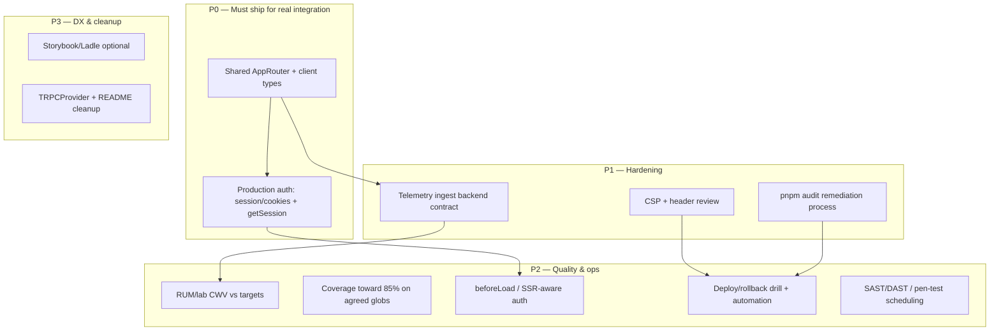

# Web TanStack — post-review implementation plan

**Date:** 2026-04-17  
**Source of findings:** [`changelog/2026-04-17-web-tanstack-implementation-review.md`](../../../changelog/2026-04-17-web-tanstack-implementation-review.md)  
**Related:** [`web-tanstack-start-recommendations-implementation-plan-2026-04-17.md`](./web-tanstack-start-recommendations-implementation-plan-2026-04-17.md), phase changelogs `changelog/2026-04-17-web-tanstack-phase-*.md`

---

## 1. Purpose

This document turns the **implementation review** into a **sequenced, checkable execution plan**. It preserves priority order (P0 → P3), calls out **dependencies**, and marks **parallel-agent** opportunities (e.g. Cursor multi-agent / isolated branches) where workstreams do not block each other.

**Out of scope here:** Re-litigating architecture choices already captured in the research memo; this plan assumes the review’s gap analysis is accepted.

---

## 2. Guiding principles

1. **Unblock types first** — Shared `AppRouter` removes stub drift and enables real procedures everywhere.
2. **Security and auth are not optional** — Production auth and CSP belong in early waves after typing, not as “later polish.”
3. **Parallelize by boundary** — API package work, web-only UI, infra/CI, and security review can often proceed on separate agents when contracts are thin or frozen behind interfaces.
4. **Exit criteria are measurable** — Each stream lists acceptance checks the team can verify in CI or staging.

---

## 3. Dependency overview (high level)

**Rule of thumb:** Finish **P0-A** before large web refactors that touch many tRPC calls. **P0-B** should follow quickly so headers and tenant context use real session semantics.

---

## 4. Parallel execution model (agents)

Use **multiple agents** when:

- Tasks touch **disjoint paths** (e.g. `packages/api` vs `apps/frontend/src/lib/observability` vs `.github/workflows`).
- Tasks need **different expertise** (security/CSP vs Vitest coverage vs Nitro config).
- One stream is **documentation/process** and another is **code**.

**Synchronization points** (single agent or short human review):

- After **AppRouter** export: merge before widespread `import type { AppRouter }` edits in web.
- Before **CSP** merge: validate Mantine + TanStack + any inline scripts in staging.
- Before **telemetry** cutover: freeze event schema and auth method.

**Suggested agent split (example):**

| Agent       | Focus                                                                    | Can start when                                                              |
| ----------- | ------------------------------------------------------------------------ | --------------------------------------------------------------------------- |
| **Agent 1** | `AppRouter` export, stub removal, web client typing                      | Immediately                                                                 |
| **Agent 2** | Auth API + session integration tests (against interfaces if router lags) | After router contract shape is agreed; can stub procedure names until merge |
| **Agent 3** | CSP + Nitro + security headers                                           | In parallel with Agent 1 if CSP does not depend on new routes               |
| **Agent 4** | Telemetry ingest service contract + client alignment                     | After event schema agreed; parallel with CSP if no shared files             |
| **Agent 5** | CI audit remediation / dependency upgrades                               | Parallel; avoid conflicting `package.json` merges—coordinate lockfile       |
| **Agent 6** | Vitest globs + coverage                                                  | Parallel with feature work on different files                               |
| **Agent 7** | Docs: TRPCProvider, README, runbooks                                     | Parallel; no block on code except final accuracy pass                       |

**Lockfile rule:** Only **one** agent at a time should run broad `pnpm` dependency upgrades unless using isolated git worktrees and deliberate merge order.

---

## 5. P0 — Critical path

### 5.1 Shared tRPC `AppRouter` and generated client types

**Problem statement:** [`apps/frontend/src/lib/api/app-router.stub.ts`](../../../apps/frontend/src/lib/api/app-router.stub.ts) risks drift; web cannot be type-safe against real procedures.

**Steps**

1. **Define the SSOT** for the router type: export `AppRouter` from `@agenticverdict/api` (or a dedicated `@agenticverdict/trpc-contract` package if the team splits client/server).
2. **Wire the web app** to import `AppRouter` from that package; delete or shrink the stub to re-exports only during migration if needed.
3. **Update** `apps/frontend/src/lib/api/trpc-client.ts` and any `createTRPCReact` / `inferRouterInputs` usage to use the shared type.
4. **CI:** Ensure `pnpm --filter @agenticverdict/web build` and typecheck fail on procedure renames (desired).

**Acceptance criteria**

- [ ] No standalone duplicate `AppRouter` shape in `apps/frontend` except a thin re-export if required.
- [ ] `trpc` hooks and `RouterOutputs`/`RouterInputs` resolve to real procedures.
- [ ] Document the import path in `apps/frontend/README.md` (one paragraph).

**Parallel agents:** **Agent A** (api package export + tRPC server registration) and **Agent B** (web imports + tests) can split **after** the export path and package name are fixed in a short planning message.

---

### 5.2 Production auth path (cookies or bearer + `getSession`)

**Problem statement:** [`apps/frontend/src/lib/api/auth-api.ts`](../../../apps/frontend/src/lib/api/auth-api.ts) uses a mock session bridge; real deployments need cookie/bearer semantics and tenant-safe session.

**Steps**

1. **API:** Implement or expose `auth.getSession` (or equivalent) with stable error shapes aligned with existing `trpc-error-mapping`.
2. **Transport:** Decide cookie vs Authorization header for browser; configure CORS/credentials consistently with Phase 4 telemetry and future CSP.
3. **Web:** Replace mock paths in `auth-api.ts` / `SessionProvider` with real fetch/tRPC calls; keep a **dev-only** mock behind `import.meta.env` if useful for local UX.
4. **Tests:** Add integration tests (review already calls for these): session persistence, logout, unauthorized handling on protected routes.
5. **Dashboard:** Confirm [`apps/frontend/src/routes/$locale/dashboard.tsx`](../../../apps/frontend/src/routes/$locale/dashboard.tsx) and `useRequireAuth` behave with real latency and errors.

**Acceptance criteria**

- [ ] No default “logged in” mock in production builds.
- [ ] Session invalidation and refresh behavior documented briefly in code or `apps/frontend` README.
- [ ] Integration tests cover happy path + 401/403.

**Parallel agents:** **Agent Auth-API** (server procedures + Fastify session middleware) and **Agent Auth-Web** (client wiring) can parallelize with a **frozen** `SessionDTO` TypeScript type reviewed once.

---

## 6. P1 — Security and operations

### 6.1 CSP and security header review

**Problem statement:** Nitro headers exist on `/**`, but **CSP is absent**; Phase 4 called for hardening.

**Steps**

1. Inventory inline scripts and style sources (Mantine, TanStack dev vs prod).
2. Choose **nonce** or **hash** CSP compatible with Vite + SSR if applicable.
3. Implement in Nitro `routeRules` / server config; add staging verification checklist.
4. Pair with **P0 auth** for cookie `SameSite` / `Secure` expectations.

**Acceptance criteria**

- [ ] CSP present in production configuration; documented exceptions.
- [ ] No critical console CSP violations on home, login, dashboard.

**Parallel agents:** Run alongside **P0** once static asset and script inventory is done—often **Agent Security** independent of `AppRouter` if coordination on `vite.config.ts` merges is serialized.

---

### 6.2 Telemetry ingest backend (auth, schema, sampling, PII)

**Problem statement:** [`apps/frontend/src/lib/observability/telemetry-ingest.ts`](../../../apps/frontend/src/lib/observability/telemetry-ingest.ts) posts to optional `VITE_PUBLIC_TELEMETRY_INGEST_URL` without a full backend contract.

**Steps**

1. Define **event schema** (versioned JSON) for client logs and web-vitals payloads.
2. Implement ingest **authentication** (API key, JWT, or mTLS—pick per org standards).
3. **Sampling** and **PII** review: document what must never be sent (review against `client-log.ts` redaction).
4. Align **onboarding analytics** and **WebVitalsReporter** with the same pipeline.
5. Staging **load/smoke** test for batching and failure behavior.

**Acceptance criteria**

- [ ] Ingest endpoint rejects unsigned/unauthenticated requests in production.
- [ ] Runbook snippet: rotation, retention, and dashboard location (vendor or internal).

**Parallel agents:** **Agent Ingest** (backend + infra) and **Agent Client** (web payload tweaks) parallelize after **schema v1** is checked in as a JSON schema or Zod in a shared package.

---

### 6.3 Dependency audit remediation

**Problem statement:** CI runs `pnpm audit` as **informational**; org policy may require failing builds on critical issues.

**Steps**

1. Export current audit report from CI artifact; triage **critical/high**.
2. Schedule upgrades per package; run `turbo run test` and web build.
3. Decide policy: **fail CI** on severity threshold vs weekly backlog.

**Acceptance criteria**

- [ ] Documented policy in `docs/` or `CONTRIBUTING` (where the team tracks quality gates).
- [ ] Critical issues either fixed or explicitly waived with ticket IDs.

**Parallel agents:** Prefer **dedicated agent** for dependency bumps; **avoid** parallel agents editing `pnpm-lock.yaml`.

---

## 7. P2 — Metrics, quality, SSR, release engineering

### 7.1 Lab or RUM dashboards for CWV (LCP / INP / CLS)

**Problem statement:** Instrumentation exists; **no in-repo proof** of meeting plan thresholds.

**Steps**

1. Choose **Lighthouse CI** in GitHub Actions, **vendor RUM**, or **self-hosted** Grafana from ingest.
2. Bind **reference tenant** and environment variables documented in phase-3 changelog.
3. Add a **single** markdown report or CI artifact that states thresholds and last result.

**Acceptance criteria**

- [ ] At least one automated or documented periodic check tied to main branch or release tags.

**Parallel agents:** **Agent QA** can own this fully in parallel with feature teams if ingest URL/env is available.

---

### 7.2 Coverage expansion (toward 85% on agreed globs)

**Problem statement:** [`apps/frontend/vitest.config.mjs`](../../../apps/frontend/vitest.config.mjs) uses a narrower gate than global **85%** strategy.

**Steps**

1. Agree **globs** for “business modules” (e.g. `lib/api`, `lib/tenant`, `lib/observability`).
2. Raise thresholds incrementally to avoid main-branch churn.
3. Optionally include `apps/frontend` in monorepo coverage aggregation or keep package-local—**decide explicitly**.

**Acceptance criteria**

- [ ] Documented threshold and glob list; CI enforces agreed floor.

**Parallel agents:** **Agent Test** can add tests file-by-file in parallel with small PRs; same lockfile caution as audits.

---

### 7.3 `beforeLoad` / SSR-aware auth for protected routes

**Problem statement:** Review notes **no `beforeLoad`/SSR session** yet; risks flash of unauthorized content.

**Steps**

1. After **P0 auth**, add server-readable session to TanStack Start loaders where supported.
2. Move critical redirects from client-only `useRequireAuth` to `beforeLoad` where possible.
3. E2E test: first paint of protected route never shows dashboard shell to anonymous users.

**Acceptance criteria**

- [ ] Documented behavior for SSR vs client-only environments.

**Parallel agents:** Depends on **P0-B**; do not parallel with unrelated route refactors on the same files.

---

### 7.4 Deploy / rollback automation and exercised drill

**Problem statement:** Phase 4 exit criteria expected **rollback exercised**; not evidenced in repo.

**Steps**

1. Add or link **existing** deployment workflow docs; ensure web image version pinning is clear.
2. Run **tabletop**: deploy N+1, rollback to N, verify session and static assets.
3. Capture **runbook** steps under `docs/05-reference/runbooks/` (or ops SSOT).

**Acceptance criteria**

- [ ] Dated drill record (even internal) with participants and outcome.
- [ ] Rollback steps < 1 page, copy-paste friendly.

**Parallel agents:** **Agent Ops** (docs + pipeline) in parallel with code streams if no `ci.yml` conflict.

---

### 7.5 SAST / DAST / pen-test scheduling

**Problem statement:** Explicitly deferred in phase changelog; needed for full production narrative.

**Steps**

1. Open security backlog items: SAST in CI, DAST against staging, annual pen-test.
2. Assign owners and calendar slots; link to compliance requirements if any.

**Acceptance criteria**

- [ ] Tickets exist with dates; CI SAST optional first quick win.

**Parallel agents:** Fully parallel **process** track.

---

## 8. P3 — Product completeness and DX

### 8.1 Feature flags admin — real data

**Replace** [`mock-feature-flag-snapshot.ts`](../../../apps/frontend/src/lib/feature-flags/mock-feature-flag-snapshot.ts) with `createFeatureFlagService` + RBAC from `@agenticverdict/database` / API procedures.

**Parallel agents:** After **P0 AppRouter** exposes admin procedures; can be **Agent Feature**.

---

### 8.2 Tenant branding — CompanyConfig-driven theme

**Replace** reference UUID mapping in [`tenant-branding.ts`](../../../apps/frontend/src/lib/tenant/tenant-branding.ts) with config from API; mitigate **theme flash** (review finding).

**Depends on:** Tenant API surface and caching strategy. Parallel with **8.1** if different files.

---

### 8.3 Tenant resolution — subdomain / path slug → UUID

Browser-side **subdomain/slug → tenant UUID** remains follow-up; align with `packages/core` server resolution.

**Parallel agents:** **Agent Tenant** can prototype behind feature flag independently of auth if headers contract is stable.

---

### 8.4 Storybook / Ladle (optional)

Plan open question; treat as **optional** spike after P1 stability.

---

### 8.5 Documentation cleanup — `TRPCProvider` and README

**Problem statement:** [`TRPCProvider.tsx`](../../../apps/frontend/src/providers/TRPCProvider.tsx) is stale; `apps/frontend/src/lib/api/*.md` may still describe legacy wrapping.

**Steps**

1. Remove or refactor `TRPCProvider` to match [`Providers.tsx`](../../../apps/frontend/src/components/Providers.tsx) reality.
2. Update `README.md` / `AUTH_API_USAGE.md` to describe `@trpc/react-query` setup only.

**Parallel agents:** **Agent Docs** in parallel with any week; verify after P0 to avoid doc drift.

---

## 9. Suggested execution timeline (illustrative)

| Week   | Focus                                       | Parallel tracks                               |
| ------ | ------------------------------------------- | --------------------------------------------- |
| **1**  | P0-A AppRouter export + web adoption        | Agent: api export ∥ Agent: docs stub note     |
| **2**  | P0-B Auth end-to-end + tests                | Agent: server ∥ Agent: client (sync on types) |
| **3**  | P1 CSP + telemetry schema/backend           | Agent: CSP ∥ Agent: ingest (schema locked)    |
| **4**  | P1 audit remediation; start P2 coverage/RUM | Single lockfile owner                         |
| **5+** | P2 SSR auth, deploy drill, SAST scheduling  | Parallel ops vs dev                           |

Adjust to team capacity; **P0 should not be parallelized away**—it is the critical path.

---

## 10. Verification checklist (rollup)

Use this as a release gate before declaring “production complete” for the web app:

- [ ] **P0:** Shared `AppRouter`; no production mock auth default.
- [ ] **P1:** CSP deployed; telemetry ingest authenticated; audit policy decided.
- [ ] **P2:** CWV evidence; coverage policy met; SSR/beforeLoad auth acceptable; rollback drill documented.
- [ ] **P3:** Feature flags + branding + tenant resolution either done or explicitly scoped with tickets.

---

## Document control

**Version:** 1.0  
**Derived from:** `changelog/2026-04-17-web-tanstack-implementation-review.md`  
**Next review:** After P0 completion or quarterly
