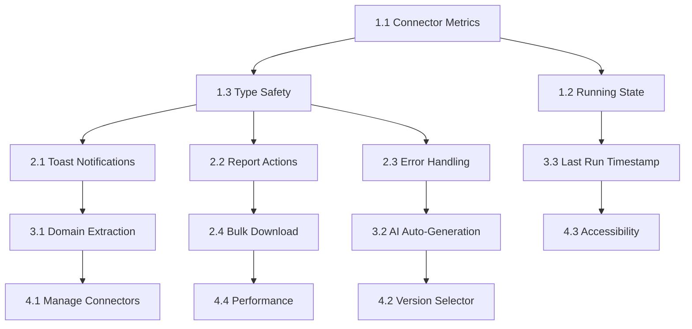

# Insights Feature Remediation Plan

**Generated:** 2026-05-04  
**Based on:** `/tmp/insights-feature-analysis.md`  
**Estimated Effort:** 2-3 days (16-24 hours)  
**Priority:** High (Blocks production launch)

---

## Phase 1: Critical Fixes (Day 1 - 6 hours)

### Task 1.1: Connector Metrics API Integration

**Severity:** Critical  
**Effort:** 2 hours  
**Dependencies:** Backend metrics endpoint  
**Files:** `features/connectors/api/`, `InsightCreateWizard.tsx`, `InsightEditPage.tsx`

**Actions:**

1. Create `useConnectorMetrics` hook in `features/connectors/api/connector-api.ts`

   ```typescript
   export function useConnectorMetrics(connectorIds: string[]) {
     return trpc.connector.getMetrics.useQuery(
       { connectorIds },
       { enabled: connectorIds.length > 0 },
     );
   }
   ```

2. Update wizard to fetch and pass metrics:

   ```typescript
   const { data: metricsData } = useConnectorMetrics(watch("connectorIds"));
   const connectorMetrics = useMemo(
     () =>
       metricsData?.metrics.map((m) => ({
         connectorId: m.connectorId,
         connectorName: m.name,
         metrics: m.availableMetrics,
       })) || [],
     [metricsData],
   );
   ```

3. Update `MetricConfigurationStep` to accept and display metrics

**Testing:**

- Unit test: Hook returns metrics for valid connector IDs
- Integration: Wizard displays metrics for selected connectors
- E2E: Create insight with multiple connectors and metrics

**Acceptance Criteria:**

- [ ] Metrics load dynamically based on selected connectors
- [ ] Loading state shown while fetching metrics
- [ ] Error state if metrics fetch fails
- [ ] At least 1 metric required per connector (validation)

---

### Task 1.2: Running State Implementation

**Severity:** Critical  
**Effort:** 1.5 hours  
**Dependencies:** Backend execution status tracking  
**Files:** `types.ts`, `InsightListPage.tsx`, `InsightDetailPage.tsx`, tRPC router

**Actions:**

1. Update `InsightListItem` type:

   ```typescript
   export interface InsightListItem {
     // ... existing fields
     status: "idle" | "running" | "completed" | "failed";
     lastRunAt: Date | null;
     lastRunStatus?: "success" | "failed";
   }
   ```

2. Update tRPC router to populate status from recent job execution

3. Update UI components:
   - `InsightListPage.tsx`: Replace `isRunning = false` with `insight.status === 'running'`
   - `InsightDetailPage.tsx`: Add running indicator to PageHeader
   - Disable "Run Now" button when running

**Testing:**

- Unit: Status badge displays correct variant
- Integration: Button disabled during execution
- E2E: Run insight, observe status change

**Acceptance Criteria:**

- [ ] Running insights show spinner indicator
- [ ] "Run Now" button disabled during execution
- [ ] Last run timestamp displayed
- [ ] Last run status (success/failed) shown

---

### Task 1.3: Type Safety for JSONB Fields

**Severity:** Critical  
**Effort:** 2.5 hours  
**Files:** `types.ts`, all pages with type assertions

**Actions:**

1. Define proper interfaces:

   ```typescript
   export interface InsightAIConfig {
     model: string;
     provider?: "anthropic" | "openai";
     qualityLevel: "standard" | "premium";
     detailLevel: "executive" | "standard" | "comprehensive";
     customPrompt?: string;
   }

   export interface InsightSchedule {
     enabled: boolean;
     frequency?: "daily" | "weekly" | "monthly" | "quarterly";
     time?: number; // hour of day (0-23)
     dayOfWeek?: number;
     dayOfMonth?: number;
   }

   export interface InsightDelivery {
     format: "pdf" | "excel" | "both";
     channels: ("email" | "dashboard")[];
     recipients?: string[];
     emailRecipients?: string[];
     webhookUrl?: string;
     enableWebhook?: boolean;
   }
   ```

2. Update `InsightListItem`:

   ```typescript
   export interface InsightListItem {
     // ...
     aiConfig: InsightAIConfig;
     schedule: InsightSchedule;
     delivery: InsightDelivery;
     connectors: InsightConnector[];
   }
   ```

3. Replace all `as` assertions with proper type access

**Testing:**

- TypeScript: Zero type errors
- Runtime: No undefined access errors

**Acceptance Criteria:**

- [ ] All JSONB fields have proper TypeScript interfaces
- [ ] Zero `as` type assertions in production code
- [ ] TypeScript strict mode passes
- [ ] Runtime type guards for API responses

---

## Phase 2: High Priority (Day 2 - 8 hours)

### Task 2.1: Toast Notifications

**Severity:** High  
**Effort:** 2 hours  
**Files:** `InsightDetailPage.tsx`, `InsightEditPage.tsx`, `ReportListPage.tsx`

**Actions:**

1. Import notification utilities:

   ```typescript
   import { showSuccessNotification, showErrorNotification } from "@/lib/notifications";
   ```

2. Update all mutation handlers:

   ```typescript
   const runMutation = useInsightRun({
     onSuccess: () => {
       showSuccessNotification({
         title: "Insight started",
         message: "Report generation in progress",
       });
     },
     onError: (error) => {
       showErrorNotification({
         title: "Failed to start insight",
         message: error.message || "Please try again",
       });
     },
   });
   ```

3. Apply to all mutations:
   - `useInsightCreate`
   - `useInsightUpdate`
   - `useInsightDelete`
   - `useInsightRun`
   - `useReportDelete`
   - `useReportDeleteMany`

**Testing:**

- Manual: Trigger each mutation, verify toast appears
- Unit: Mock notifications, verify calls

**Acceptance Criteria:**

- [ ] Success toast on all successful mutations
- [ ] Error toast on all failed mutations
- [ ] Error messages from canonical error system
- [ ] Toasts auto-dismiss after 5 seconds

---

### Task 2.2: Report Actions Wiring

**Severity:** High  
**Effort:** 2 hours  
**Files:** `InsightDetailPage.tsx`, `ReportListPage.tsx`

**Actions:**

1. Add handlers to `RecentReports` component:

   ```typescript
   const handleViewReport = (reportId: string) => {
     navigate.push(ROUTE_PATHS.DASHBOARD_REPORTS_VIEWER.replace("$id", reportId));
   };

   const handleDownloadReport = async (reportId: string) => {
     const { data } = await reportContentQuery({ id: reportId, format: "pdf" });
     if (data?.content) {
       // Download logic
     }
   };

   const handleShareReport = (reportId: string) => {
     setSelectedReportId(reportId);
     setShareModalOpened(true);
   };
   ```

2. Wire buttons in `ReportListPage.tsx`:
   - View: Navigate to viewer
   - Download: Trigger download
   - Share: Open modal

**Testing:**

- E2E: Click each action, verify correct behavior
- Unit: Handlers call correct navigation/download functions

**Acceptance Criteria:**

- [ ] View button navigates to report viewer
- [ ] Download button downloads report file
- [ ] Share button opens share modal
- [ ] Actions work from list and overview tabs

---

### Task 2.3: Error Handling Improvements

**Severity:** High  
**Effort:** 2 hours  
**Files:** All pages, `core/error-system/`

**Actions:**

1. Import error translator:

   ```typescript
   import { translateError } from "@/core/error-system";
   ```

2. Update error states:

   ```typescript
   if (error) {
     const translated = translateError(error);
     return (
       <Alert variant="light" color="red" icon={<IconAlertCircle />}>
         <Text fw={500}>{translated.title}</Text>
         <Text size="sm">{translated.message}</Text>
         <Code size="xs" mt="xs">Error: {translated.code}</Code>
       </Alert>
     );
   }
   ```

3. Add error boundaries:

   ```typescript
   import { ErrorBoundary } from '@/components/error-boundary';

   <ErrorBoundary fallback="Failed to load insights">
     <InsightListPage />
   </ErrorBoundary>
   ```

**Testing:**

- Manual: Trigger various errors, verify messages
- Unit: Error translator maps codes correctly

**Acceptance Criteria:**

- [ ] User-friendly error messages for all error codes
- [ ] Error codes displayed for support tickets
- [ ] Error boundaries prevent full page crashes
- [ ] Errors logged with tenant context

---

### Task 2.4: Bulk Download Implementation

**Severity:** High  
**Effort:** 2 hours  
**Dependencies:** JSZip library  
**Files:** `ReportListPage.tsx`

**Actions:**

1. Install JSZip if not present:

   ```bash
   pnpm add jszip
   ```

2. Implement bulk download:

   ```typescript
   import JSZip from "jszip";

   const handleBulkDownload = async () => {
     const zip = new JSZip();
     const reportFolder = zip.folder("reports");

     for (const reportId of selectedReports) {
       const { data } = await reportContentQuery({ id: reportId, format: "pdf" });
       if (data?.content) {
         reportFolder.file(`${reportId}.pdf`, data.content, { base64: true });
       }
     }

     const blob = await zip.generateAsync({ type: "blob" });
     const url = URL.createObjectURL(blob);
     const link = document.createElement("a");
     link.href = url;
     link.download = `reports-${new Date().toISOString().split("T")[0]}.zip`;
     link.click();
   };
   ```

3. Add loading state for large downloads

**Testing:**

- Manual: Select multiple reports, download zip
- Verify: All reports in zip, files open correctly

**Acceptance Criteria:**

- [ ] Bulk download creates valid zip file
- [ ] All selected reports included
- [ ] Progress indicator for large downloads
- [ ] Error handling for failed downloads

---

## Phase 3: Medium Priority (Day 3 - 6 hours)

### Task 3.1: Domain Extraction

**Severity:** Medium  
**Effort:** 1 hour  
**Files:** `types.ts`, `InsightEditPage.tsx`, backend router

**Actions:**

1. Add domain to insight schema (backend)
2. Update type definition:
   ```typescript
   export interface InsightListItem {
     // ...
     domain: string;
   }
   ```
3. Remove hardcoded domain in `InsightEditPage.tsx`

**Acceptance Criteria:**

- [ ] Domain populated from backend
- [ ] Domain displayed in insight cards
- [ ] Domain filterable in list page

---

### Task 3.2: AI Insights Auto-Generation

**Severity:** Medium  
**Effort:** 2 hours  
**Dependencies:** Backend event system  
**Files:** Backend worker, `InsightDetailPage.tsx`

**Actions:**

1. Add AI insights generation trigger in worker after report completion
2. Manual trigger button should be optional
3. Auto-refresh AI insights card when report completes

**Acceptance Criteria:**

- [ ] AI insights generated automatically after report
- [ ] Insights card refreshes without manual trigger
- [ ] Loading state during generation

---

### Task 3.3: Last Run Timestamp

**Severity:** Medium  
**Effort:** 1 hour  
**Files:** `types.ts`, `InsightListPage.tsx`, backend router

**Actions:**

1. Add `lastRunAt` to insight schema
2. Populate from most recent report creation timestamp
3. Display in insight cards

**Acceptance Criteria:**

- [ ] Last run timestamp displayed
- [ ] "Never run" state for new insights
- [ ] Timestamp updates after manual run

---

### Task 3.4: Type Assertion Cleanup

**Severity:** Medium  
**Effort:** 2 hours  
**Files:** All files with `as` assertions

**Actions:**

1. Search for all `as` assertions
2. Replace with proper type guards or interfaces
3. Add runtime validation where needed

**Acceptance Criteria:**

- [ ] Zero unsafe type assertions
- [ ] All runtime types validated
- [ ] TypeScript strict mode passes

---

## Phase 4: Polish (Post-Launch - 4 hours)

### Task 4.1: Manage Connectors Modal

**Effort:** 1.5 hours

**Actions:**

- Open connector creation modal from wizard
- Refresh connector list after creation
- Auto-select new connector

---

### Task 4.2: Version Selector

**Effort:** 1 hour

**Actions:**

- Extract versions from report metadata
- Populate dropdown
- Handle version switching

---

### Task 4.3: Accessibility Audit

**Effort:** 1.5 hours

**Actions:**

- Add `aria-label` to all icon buttons
- Verify keyboard navigation
- Add screen reader announcements

---

### Task 4.4: Performance Optimization

**Effort:** 2 hours

**Actions:**

- Add virtualization for long lists
- Implement infinite scroll
- Optimize React Query caching

---

## Testing Strategy

### Unit Tests (Required)

- [ ] All new hooks have unit tests
- [ ] Validation schemas tested
- [ ] Error translator tested
- [ ] Type guards tested

### Integration Tests (Required)

- [ ] Wizard flow with real API data
- [ ] Report actions (view/download/share)
- [ ] Bulk operations
- [ ] Error scenarios

### E2E Tests (Required)

- [ ] Create insight end-to-end
- [ ] Edit insight and save
- [ ] Run insight and view report
- [ ] Share report and access via token
- [ ] Delete insight and verify removal

### Accessibility Tests (Required)

- [ ] Keyboard navigation
- [ ] Screen reader compatibility
- [ ] Color contrast
- [ ] Focus indicators

---

## Rollback Plan

If critical issues discovered post-deployment:

1. **Immediate:** Disable insights feature flag
2. **Short-term:** Revert to previous deployment
3. **Long-term:** Fix issues in staging, re-test, re-deploy

**Feature Flag:** `ENABLE_INSIGHTS_UI` (already implemented)

---

## Success Metrics

### Quality Gates

- [ ] TypeScript: Zero errors
- [ ] Lint: Zero violations
- [ ] Tests: 70%+ coverage overall, 85%+ business logic
- [ ] E2E: All critical paths passing

### User Experience

- [ ] Toast notifications on all actions
- [ ] Clear error messages
- [ ] Loading states for all async operations
- [ ] Accessible to screen reader users

### Performance

- [ ] Page load < 3 seconds
- [ ] API calls < 500ms (p95)
- [ ] No memory leaks in long sessions

---

## Task Dependencies



---

## Estimated Timeline

| Phase             | Tasks              | Hours  | Days    |
| ----------------- | ------------------ | ------ | ------- |
| Phase 1: Critical | 1.1, 1.2, 1.3      | 6      | 1       |
| Phase 2: High     | 2.1, 2.2, 2.3, 2.4 | 8      | 1-2     |
| Phase 3: Medium   | 3.1, 3.2, 3.3, 3.4 | 6      | 1       |
| Phase 4: Polish   | 4.1, 4.2, 4.3, 4.4 | 4      | 0.5     |
| **Total**         | **15 tasks**       | **24** | **3.5** |

**Recommended:** Complete Phases 1-3 before production launch (3 days). Phase 4 can be post-launch polish.

---

## Resource Requirements

### Development

- 1 Frontend developer (3-4 days)
- 1 Backend developer (1-2 days for API updates)

### Testing

- 1 QA engineer (1-2 days)
- Accessibility testing tools (axe, WAVE)

### Review

- Code review: 2-4 hours
- Security review: 1-2 hours
- UX review: 1 hour

---

## Risk Assessment

| Risk                   | Likelihood | Impact | Mitigation                              |
| ---------------------- | ---------- | ------ | --------------------------------------- |
| Backend API delays     | Medium     | High   | Mock data for frontend development      |
| Type safety issues     | Low        | High   | Strict TypeScript, thorough testing     |
| Performance regression | Low        | Medium | Load testing before launch              |
| Accessibility gaps     | Medium     | Medium | Early accessibility audit               |
| Scope creep            | Medium     | Medium | Strict prioritization, phase 4 optional |

---

## Next Steps

1. **Immediate:** Start Phase 1 tasks (Critical fixes)
2. **Day 1 EOD:** Review progress, adjust estimates if needed
3. **Day 2:** Begin Phase 2 (High priority)
4. **Day 3:** Complete Phase 3, begin testing
5. **Day 4:** Final testing, code review, deployment prep

**Deployment:** Target end of Day 4 or Day 5 morning, behind feature flag initially.
