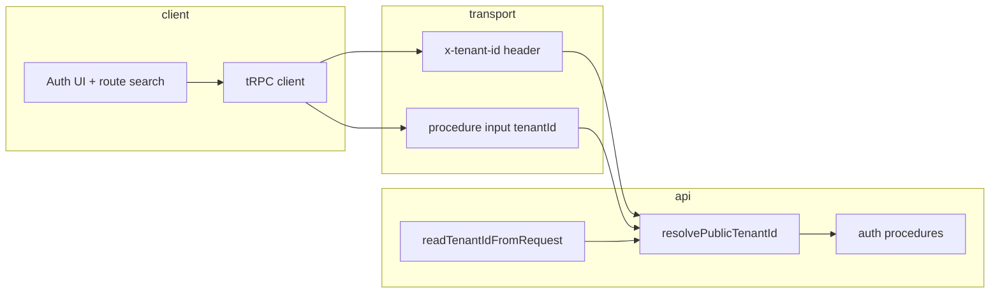

# Tenant context for public auth and tRPC: root-cause analysis and remediation plan

**Date:** 2026-04-25  
**Scope:** Browser and SSR clients calling Fastify-hosted tRPC `auth.*` procedures (especially `auth.verifyEmail`), `x-tenant-id` handling, and multi-tenant correctness.  
**Status:** Planning / architecture (not an implementation checklist in code).

**Assumption:** The product is **greenfield and pre-production**. There is **no obligation** to preserve backward compatibility with prior API error strings, log-parser expectations, shipped third-party clients, or “header-only forever” behavior. The contract can be chosen for clarity and maintainability; all first-party clients and docs are updated in lockstep with the API.

---

## 1. Executive summary

The `400 Bad Request` with message **`Missing x-tenant-id`** is thrown by the **API** (`apps/api/src/trpc/routers/auth.ts`) when `readTenantIdFromRequest` finds no valid UUID in the **`x-tenant-id`** header. The failure is most visible on **`auth.verifyEmail`** because that flow is typically **pre-session**: the client has not logged in, so any tenant id held only in post-login state (for example `authStore`) is empty, while several public procedures **do not accept tenant id in the JSON input** the way `auth.register` does.

Interim mitigations (publishing tenant from `TenantProvider` into a module-level bridge, query-string propagation, dev-only hardcoded tenant UUIDs) **paper over a structural gap**: tenant resolution for HTTP clients is split across **React lifecycle**, **Zustand**, **`httpBatchLink` headers**, and **optional env defaults**, without a single, explicit contract for “how a public auth call identifies the tenant.”

This document defines **root causes**, a **target model**, and a **phased remediation** that is reusable across procedures, maintainable, and free of hidden globals—using deliberate **API and type contract** changes and one **frontend propagation strategy** chosen as the single source of truth. Because the stack is not yet bound by production compatibility, those changes do not need to preserve legacy shapes or messages “for existing consumers.”

---

## 2. Observed behavior

- **Request:** `POST …/trpc/auth.verifyEmail?batch=1` with body input `{ email, code }` (and SuperJSON envelope as applicable).
- **Response:** `400` / `TRPCClientError` with message **`Missing x-tenant-id`**.
- **Origin:** Server-side guard in `verifyEmail` (same pattern exists for `login`, `resendEmailVerification`, `requestPasswordReset`).

The stack trace may reference frontend chunks that bundle tenant utilities; the **authoritative source** of the string is still the API `TRPCError` message.

---

## 3. Root-cause analysis

### 3.1 Asymmetric API contract for tenant on public procedures

| Procedure                      | Tenant today                                                                        |
| ------------------------------ | ----------------------------------------------------------------------------------- |
| `auth.register`                | `input.tenantId` **or** `x-tenant-id` (`input.tenantId ?? readTenantIdFromRequest`) |
| `auth.login`                   | **`x-tenant-id` only**                                                              |
| `auth.verifyEmail`             | **`x-tenant-id` only**                                                              |
| `auth.resendEmailVerification` | **`x-tenant-id` only**                                                              |
| `auth.requestPasswordReset`    | **`x-tenant-id` only**                                                              |

`register` can complete without a header if the client sends `tenantId` in the body. **`verifyEmail` cannot**, yet it needs the same logical tenant key to scope the user row (`tenant_id` / `tenantId`) and in-memory rate-limit keys (`buildVerifyKey(tenantId, email)`).

**Root cause (contract):** tenant identification for public auth is **not modeled consistently** across procedures; the client must infer that some calls are “header-only.”

---

### 3.2 React context vs tRPC link headers (architectural boundary)

Effective tenant on the web client is computed in **`TenantProvider`** using:

- authenticated tenant from the auth store,
- optional `tenant.resolveSlug` (host-based),
- optional `VITE_PUBLIC_DEFAULT_TENANT_ID`.

`tRPC`’s **`httpBatchLink`** evaluates `headers()` **outside React**. Any logic that exists only inside React (context, effects, query results) is **not automatically available** to `headers()` unless duplicated, bridged, or replaced with a synchronous source.

**Root cause (client architecture):** two competing “sources of truth” for the same value—**React tree** vs **link-level synchronous header builder**—without a formally owned bridge document or a contract that avoids the bridge entirely.

---

### 3.3 Bootstrap ordering and optional env defaults

If the user has **no** session tenant, **no** slug resolution (localhost, wrong env, or hostname not in `VITE_PUBLIC_TENANT_BASE_DOMAINS`), and **no** `VITE_PUBLIC_DEFAULT_TENANT_ID`, then **no UUID exists** for `buildTrpcHeaders()` to send until something else runs (effect, query completion, or a workaround).

**Root cause (bootstrap):** “default tenant for this deployment” is **optional in configuration** but **mandatory at runtime** for these endpoints. The system does not fail fast at startup with a clear configuration error; it fails on first mutation with a generic API message.

---

### 3.4 SSR and `fetchProtectedRouteSession`

Server-side session probing forwards **`x-tenant-id` from the incoming request** to the API. If the browser never sends that header, SSR cannot invent a consistent tenant for downstream `auth.getSession` alignment (session JWT may still work, but cross-layer consistency depends on how the API uses headers vs cookies).

**Root cause (SSR):** SSR assumes the **same header discipline** as the browser; there is no alternate channel (body, server env default) documented for auth routes.

---

### 3.5 Why “workarounds” accumulate

Each partial fix addresses one slice of the above:

- **Query `tenantId` + `authStore.setTenantId`:** fixes deep links and some redirects but not the fundamental header vs React split.
- **`trpc-tenant-bridge`:** duplicates `TenantProvider` resolution into a module global; **implicit coupling**, test isolation cost, and ordering sensitivity (first request before `useEffect` publishes tenant).
- **Dev hardcoded UUID:** hides misconfiguration and diverges prod vs dev behavior.

**Root cause (process):** absence of a written **tenant propagation ADR** leads to local patches instead of a single contract.

---

## 4. Target architecture (clean model)

### 4.1 Principles

1. **Explicit over implicit:** every public auth operation that is tenant-scoped must document **exactly one resolution algorithm** shared by API and clients.
2. **Prefer payload for pre-auth flows:** where the client already knows the tenant (registration, verify-email deep link, password reset initiated from a tenant-branded page), **send `tenantId` in the validated input** (optional UUID), mirroring `register`. The API may still **read** `x-tenant-id` for SSR, proxies, observability, and parity with other routers, but there is no requirement to optimize for unmigrated external callers; first-party clients should follow one documented resolution path.
3. **Single server helper:** `resolvePublicTenantId({ req, input })` returns a UUID or throws `BAD_REQUEST` with a stable machine-readable code (for example `TENANT_CONTEXT_REQUIRED` / `TENANT_MISMATCH`).
4. **No production magic defaults:** development may use tooling defaults, but **not** silent hardcoded tenant UUIDs in application code; use `.env.example`, compose templates, and startup validation.
5. **Conflicting sources:** if both header and body carry a tenant id, they **must match** or the API rejects the request (prevents subtle cross-tenant bugs in proxies and custom clients).

### 4.2 Layering

---

## 5. Remediation plan (phased)

### Phase A — Contract and API (foundation)

**Goal:** Remove “header-only” asymmetry for all **pre-session** tenant-scoped mutations.

1. **Extend shared Zod schemas** in `@agenticverdict/types` (`packages/types/src/auth.ts`):
   - Add optional `tenantId: z.string().uuid().optional()` to:
     - `verifyEmailInputSchema`
     - `resendEmailVerificationInputSchema`
     - `requestPasswordResetInputSchema`
     - (Optional but recommended for symmetry) `loginInputSchema`

   Update any **contract markdown** under `specs/` that describes tRPC auth payloads.

2. **Implement `resolvePublicTenantId`** in the API (new small module colocated with `auth` router or under `apps/api/src/trpc/`):
   - Parse header via existing `readTenantIdFromRequest` (keep strict UUID validation).
   - Parse optional `input.tenantId` when present on the procedure input type.
   - Rules:
     - If **both** present and differ → `BAD_REQUEST` with message/code `TENANT_MISMATCH`.
     - If **neither** present → `BAD_REQUEST` with code `TENANT_CONTEXT_REQUIRED` and a clear human-readable message (no need to retain the legacy string **`Missing x-tenant-id`** unless you deliberately want it for grep continuity in old notes).
     - If **one** present → use it.

3. **Refactor** `login`, `verifyEmail`, `resendEmailVerification`, `requestPasswordReset` to use the helper. **`register`** should use the same helper so all public tenant resolution is centralized.

4. **Security note (document in ADR):** exposing optional `tenantId` in verify/resend does not grant cross-tenant access: user rows remain constrained by `(email, tenant_id)`; mismatched tenant yields the same non-enumerating responses you already use for invalid codes where appropriate.

**Exit criteria:** API tests cover: header-only, body-only, both matching, both mismatching, neither. Test names and assertions should reflect the **intended** contract (including new error codes/messages), not legacy wording.

---

### Phase B — Frontend: one propagation strategy

Pick **one** primary strategy for first-party code (supplementary header behavior is optional and documented, not a compatibility layer for old clients).

**Recommended primary: pass `tenantId` in mutation inputs** for all pre-session auth flows.

1. **Verify email:** `VerifyEmailClient` / `useVerifyEmailMutation` already has access to route search (`tenantId`); ensure the mutation sends `tenantId` in the **input object**, not only via headers.
2. **Resend / password reset / login (if extended):** same pattern—derive from route, registration draft, or explicit tenant picker; pass on the payload.
3. **`buildTrpcHeaders`:** keep sending `x-tenant-id` when known (proxies, SSR forwarding, observability, consistency with non-auth routers), but **do not rely on it as the only channel** for these procedures.

**Optional secondary (special runtimes):** for **server-rendered** or **Electron** paths where the payload is awkward, document header + env defaults explicitly; this is not a “don’t touch the API” constraint—greenfield allows requiring payload everywhere the UX can supply it.

**Deprecate/remove after Phase B:**

- Module-level **`trpc-tenant-bridge`** and `publishTenantIdForTrpcHeaders` from `TenantProvider`, unless a separate ADR keeps them for **non-auth** routers that still require headers-only.
- **Hardcoded dev tenant UUID** in client code; replace with documented env in `apps/frontend` README / compose examples and optional **dev-only** startup warning when `NODE_ENV !== 'production'` and tenant default is missing **for procedures that need it**.

**Exit criteria:** With empty `authStore` and **no** `x-tenant-id` header, `verifyEmail` succeeds when `tenantId` is present in input (integration test against API).

---

### Phase C — Configuration and developer experience

1. **`.env.example` / Docker docs:** require `VITE_PUBLIC_DEFAULT_TENANT_ID` for local single-tenant stacks **or** document multi-tenant local setup with slug domains.
2. **API startup validation (optional):** if `DATABASE_URL` is set and seed expects a default tenant, log the expected tenant UUID once at boot in dev.
3. **Error payloads:** prefer stable `data.code` (tRPC error `data`) for `TENANT_CONTEXT_REQUIRED` so the UI can show “wrong workspace” instead of a raw header message.

**Exit criteria:** New developer following docs does not hit silent 400s on verify-email.

---

### Phase D — SSR, desktop, and non-browser clients

1. **`fetchProtectedRouteSession`:** when adding server-side calls that need tenant, either forward incoming header **or** attach server-known default from env consistent with Phase A rules (document which).
2. **Electron (`getDesktopApiBaseUrl`):** ensure desktop config includes tenant id channel (payload and/or header) identical to web.
3. **Regenerate or add** contract tests in `apps/frontend` for auth routes to assert **input** includes `tenantId` when search param is present.

---

### Phase E — Cleanup and governance

1. Add a short **ADR** under `docs/architecture/` (or extend `docs/architecture/ui/04-pages/authentication.md`): “Tenant context for public tRPC procedures.”
2. **Changelog** entry referencing this plan file when implementation ships.
3. Remove dead comments that claim `trpc-client` and `TenantProvider` are aligned via bridge if the bridge is deleted.

---

## 6. Testing matrix (minimum)

| Scenario             | Header  | Body `tenantId` | Expected                                                              |
| -------------------- | ------- | --------------- | --------------------------------------------------------------------- |
| Happy path           | valid   | absent          | OK (resolver accepts header alone where the contract still allows it) |
| Happy path           | absent  | valid           | OK                                                                    |
| Happy path           | valid   | same            | OK                                                                    |
| Conflict             | valid A | valid B (≠ A)   | `BAD_REQUEST` mismatch                                                |
| Missing              | absent  | absent          | `BAD_REQUEST` tenant required                                         |
| Invalid UUID in body | absent  | malformed       | Zod input error before DB                                             |

Frontend: unit tests for mutation wrappers building input; Playwright already stubs `auth.verifyEmail`—extend to assert request payload contains `tenantId` when UI provides it.

---

## 7. Risks and mitigations

| Risk                                    | Mitigation                                                                                                        |
| --------------------------------------- | ----------------------------------------------------------------------------------------------------------------- |
| Clients send mismatched header and body | Strict mismatch rule + tests                                                                                      |
| Larger payloads                         | Single UUID field; negligible                                                                                     |
| External client sends header only       | Acceptable if Phase A resolver keeps header path; not a permanent compatibility promise beyond what you document  |
| Removing bridge breaks other routers    | Audit all `buildTrpcHeaders` consumers; non-auth routers may still require header-only—document per-router policy |

---

## 8. Out of scope (for this plan)

- Row-level security and `AsyncLocalStorage` tenant propagation on the API worker path (already separate patterns in backend services).
- Replacing `x-tenant-id` globally with JWT claims for **public** procedures (possible long-term direction, but larger change to middleware and threat model).

---

## 9. Summary

The robust fix is **not** another client-side global, but **(1)** a **symmetric API contract** that accepts `tenantId` in procedure input wherever `register` already does, **(2)** a **single server resolver** for header vs body, **(3)** frontend mutations that **always pass** `tenantId` when the UX knows it, and **(4)** configuration and documentation that make the default tenant explicit in dev—without hardcoded production-unsafe fallbacks.

Implementing Phases **A** and **B** removes the need for the tenant bridge for auth flows and eliminates the class of `Missing x-tenant-id` errors that occur when React has a tenant but the tRPC link header builder does not.
