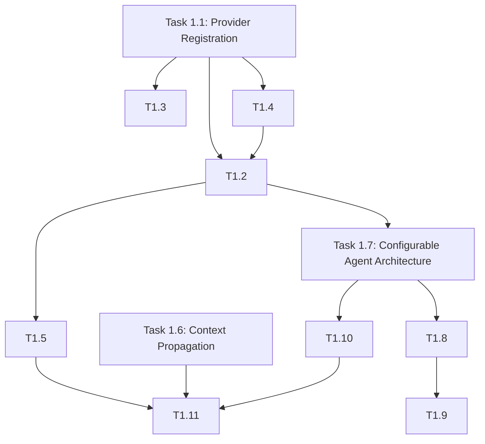

# Phase 1: Foundation & Agent Integration

**Duration:** 4 weeks  
**Effort:** 30 person-days  
**Dependencies:** None  
**Approach:** Greenfield destructive implementation (pre-production)  
**Related Documents:**

- [Agent Architecture Remediation Plan](./agent-architecture-remediation.md)
- [Business Architecture](/docs/architecture/business/business-architecture.md)
- [AI Provider Migration Plan](/docs/plans/ai-provider-migration-plan.md)

---

## Goal

Establish configuration-driven provider architecture with zero hardcoded assumptions and integrate all specialized agents with the provider system.

---

## Overview

This consolidated phase combines the foundational provider infrastructure (original Phase 1) with the agent integration work (original Phase 3) to ensure end-to-end provider architecture deployment in a single coordinated effort.

### Key Objectives

1. **Provider Registration System** - Dynamic provider discovery and registration
2. **Configuration-Driven Architecture** - Zero hardcoded provider/model references
3. **Tenant AI Configuration** - Per-tenant provider preferences and budgets
4. **Failover & Resilience** - Circuit breakers and sequential failover
5. **Agent Integration** - All specialized agents using tenant config
6. **Tenant Isolation** - AsyncLocalStorage context propagation verified

---

## Tasks

### Task 1.1: Provider Registration System

**Priority:** 🔴 Critical  
**Effort:** 2 days  
**Dependencies:** None  
**Files:** `packages/agent-runtime/src/index.ts`, `packages/agent-runtime/src/core/ProviderRegistry.ts`

**Acceptance Criteria:**

- [ ] All 5 providers (openai, anthropic, google, bedrock, openai-compatible) registered at startup
- [ ] `ProviderFactory.listProviders()` returns all registered providers
- [ ] Provider registration test passing

**Implementation:**

```typescript
// packages/agent-runtime/src/index.ts
import { OpenAIProvider } from "./providers/openai";
import { AnthropicProvider } from "./providers/anthropic";
import { GoogleProvider } from "./providers/google";
import { BedrockProvider } from "./providers/bedrock";
import { OpenAICompatibleProvider } from "./providers/openai-compatible";

export function initializeAgentRuntime(): void {
  ProviderFactory.register("openai", OpenAIProvider);
  ProviderFactory.register("anthropic", AnthropicProvider);
  ProviderFactory.register("google", GoogleProvider);
  ProviderFactory.register("bedrock", BedrockProvider);
  ProviderFactory.register("openai-compatible", OpenAICompatibleProvider);
}
```

**Testing:**

- Unit test: Provider registration
- Integration test: Provider creation

---

### Task 1.2: Remove Hardcoded Providers from Agent Factory

**Priority:** 🔴 Critical  
**Effort:** 3 days  
**Dependencies:** Task 1.1  
**Files:** `packages/agent-runtime/src/agent-factory.ts`, `packages/agent-runtime/src/provider-agent.ts`

**Acceptance Criteria:**

- [ ] Zero hardcoded provider IDs in agent-factory.ts
- [ ] Provider selection from tenant config or registry
- [ ] Model selection based on role/capabilities
- [ ] All existing tests passing

**Implementation:**

```typescript
// Replace hardcoded values with config lookup
createChatModels(config: AgentFactoryConfig) {
  const tenantConfig = this.getTenantConfig();
  const providerId = tenantConfig.ai.getProviderForRole(config.role);
  const modelId = tenantConfig.ai.getModelForRole(config.role);

  return {
    providerId,
    modelId,
    fallbackProviderId: tenantConfig.ai.fallbackProvider,
    fallbackModelId: tenantConfig.ai.fallbackModel,
  };
}
```

**Testing:**

- Unit tests for provider selection logic
- Integration tests with mock tenant config

---

### Task 1.3: Dynamic Provider Validation in API Schema

**Priority:** 🔴 Critical  
**Effort:** 2 days  
**Dependencies:** Task 1.1  
**Files:** `apps/api/src/trpc/routers/insights.ts`

**Acceptance Criteria:**

- [ ] Provider field accepts any registered provider
- [ ] Validation error for unregistered providers
- [ ] Schema tests updated

**Implementation:**

```typescript
const insightCreateSchema = z.object({
  aiConfig: z.object({
    model: z.string(),
    provider: z
      .string()
      .refine((providerId) => ProviderFactory.listProviders().includes(providerId), {
        message: "Provider not available",
      }),
    qualityLevel: z.enum(["standard", "premium"]).optional(),
    detailLevel: z.enum(["executive", "standard", "comprehensive"]),
    customPrompt: z.string().optional(),
  }),
});
```

**Testing:**

- API validation tests
- Error message verification

---

### Task 1.4: Tenant AI Configuration Schema

**Priority:** 🔴 Critical  
**Effort:** 3 days  
**Dependencies:** None  
**Files:** `packages/core/src/tenant/config-schema.ts`, `packages/database/src/schema/tenant-config.ts`

**Acceptance Criteria:**

- [ ] TenantAIConfig schema defined with all fields
- [ ] Database schema created with all required fields
- [ ] Default configuration values defined

**Schema:**

```typescript
interface TenantAIConfig {
  defaultProvider: string;
  defaultModel: string;
  fallbackProvider: string;
  fallbackModel: string;
  modelPreferences: {
    analysis?: string;
    insights?: string;
    verdict?: string;
  };
  budget: {
    monthlyLimit: number;
    alertThreshold: number;
    hardLimit: boolean;
  };
  failover: {
    enabled: boolean;
    providers: string[];
    strategy: "sequential" | "round-robin";
  };
}
```

**Testing:**

- Schema validation tests
- Schema evolution tests

---

### Task 1.5: Provider Failover Implementation

**Priority:** 🟡 High  
**Effort:** 3 days  
**Dependencies:** Task 1.2  
**Files:** `packages/agent-runtime/src/core/failover.ts`, `packages/agent-runtime/src/providers/openai/index.ts`

**Acceptance Criteria:**

- [ ] Sequential failover working
- [ ] Circuit breaker integration
- [ ] Failover events logged with tenant context

**Implementation:**

```typescript
export class ProviderFailover {
  async executeWithFailover<T>(
    providers: string[],
    execute: (providerId: string) => Promise<T>,
  ): Promise<T> {
    const errors: Error[] = [];

    for (const providerId of providers) {
      try {
        return await execute(providerId);
      } catch (error) {
        errors.push(error);
        if (!this.isRetryable(error)) {
          throw error; // Non-retryable, don't failover
        }
      }
    }

    throw new AgentRuntimeError({
      code: AgentRuntimeErrorCode.FAILOVER_EXHAUSTED,
      message: "All providers failed",
      errors,
    });
  }
}
```

**Testing:**

- Failover scenario tests
- Circuit breaker integration tests

---

### Task 1.6: AsyncLocalStorage Context Propagation Verification

**Priority:** 🟡 High  
**Effort:** 2 days  
**Dependencies:** None  
**Files:** `packages/agent-runtime/src/utils/tenant-context.ts`

**Acceptance Criteria:**

- [ ] Concurrent request test with 10+ tenants
- [ ] Zero cross-tenant context leakage
- [ ] Performance benchmark (<1ms overhead)

**Testing:**

```typescript
test("concurrent tenant isolation", async () => {
  const tenants = Array.from({ length: 10 }, (_, i) => `tenant-${i}`);
  const results = await Promise.all(
    tenants.map((tenantId) =>
      credentialManager.runWithTenantContext(tenantId, async () => {
        await sleep(random(10, 100));
        const currentTenant = credentialManager.getTenantId();
        expect(currentTenant).toBe(tenantId);
      }),
    ),
  );
});
```

---

### Task 1.7: Implement Configurable Agent Architecture Foundation

**Priority:** 🔴 Critical  
**Effort:** 4 days  
**Dependencies:** Task 1.2 (Remove Hardcoded Providers)  
**Files:**

- `packages/agent-runtime/src/configurable-agents/InsightAgentConfig.ts` (NEW)
- `packages/agent-runtime/src/configurable-agents/InsightAgentFactory.ts` (NEW)
- `packages/agent-runtime/src/specialized-marketing-agents.ts` (TO BE DELETED)

**Acceptance Criteria:**

- [ ] `InsightAgentConfig` schema defined with all configurable fields (system message, model, tools, memory, output format)
- [ ] `InsightAgentFactory` creates agents from insight configuration
- [ ] Support for custom system messages per insight
- [ ] Support for dynamic tool selection based on insight config
- [ ] All consumers updated to use new configurable agents
- [ ] Legacy `specialized-marketing-agents.ts` deleted
- [ ] Zero legacy references remaining (verified via AST scan)
- [ ] All tests passing with new implementation

**Implementation:**

```typescript
// New configurable agent creation (insight-driven)
const agent = await InsightAgentFactory.createAgent({
  id: "agent_abc123",
  insightId: "insight_xyz789",
  tenantId: "tenant_001",
  name: "Cross-Platform Marketing Analysis",
  domain: "marketing",
  systemMessage: tenantConfig.ai.customSystemMessage ?? defaultTemplate,
  templateId: "analysis.cross_platform",
  model: {
    providerId: tenantConfig.ai.defaultProvider,
    modelId: tenantConfig.ai.defaultModel,
    qualityLevel: "standard",
    detailLevel: "comprehensive",
  },
  tools: {
    enabled: tenantConfig.ai.enabledTools ?? [],
    config: tenantConfig.ai.toolConfig ?? {},
  },
  memory: { mode: "none" },
  promptVariables: tenantConfig.ai.promptVariables ?? {},
  output: { format: "json", schema: MarketingVerdictSchema },
  createdAt: new Date(),
  updatedAt: new Date(),
  createdBy: "user_123",
});
```

**Testing:**

- Unit tests for `InsightAgentFactory`
- Integration tests with mock insight configurations
- Full test suite after legacy code deletion

**Links:**

- [Agent Architecture Remediation Plan](./agent-architecture-remediation.md)
- [Business Architecture - Insight Configuration](/docs/architecture/business/business-architecture.md#24-insight-configuration)

---

### Task 1.8: AST Scan for Hardcoded Provider References

**Priority:** 🔴 Critical  
**Effort:** 2 days  
**Dependencies:** Task 1.7  
**Files:** Scripts for scanning

**Acceptance Criteria:**

- [ ] Zero hardcoded provider IDs in production code
- [ ] Scan script added to CI pipeline
- [ ] Exceptions documented (test files, examples)

**Scan Script:**

```bash
# Scan for hardcoded provider references
rg '"(openai|anthropic|google|bedrock)"' --type ts \
  --glob '!*.test.ts' \
  --glob '!**/node_modules/**' \
  --glob '!**/dist/**'
```

**Testing:**

- Manual code review
- Automated scan in CI

---

### Task 1.9: Enforce Zero Hardcoded Providers

**Priority:** 🟡 High  
**Effort:** 2 days  
**Dependencies:** Task 1.8  
**Files:** Various

**Acceptance Criteria:**

- [ ] Zero hardcoded provider initialization in production code
- [ ] All configuration loaded from tenant config or registry
- [ ] All tests passing

**Testing:**

- Full test suite
- Integration tests

---

### Task 1.10: Feature Flag for Provider System

**Priority:** 🟡 High  
**Effort:** 3 days  
**Dependencies:** Task 1.7  
**Files:** `packages/agent-runtime/src/agent-factory.ts`

**Acceptance Criteria:**

- [ ] Feature flag for provider system configuration
- [ ] Monitoring for error rates
- [ ] Configuration documented

**Implementation:**

```typescript
const useProviderSystem = process.env.USE_PROVIDER_SYSTEM === "true";

if (useProviderSystem) {
  return createAgentWithProviderSystem(config);
} else {
  return createAgentWithDefaultConfig(config);
}
```

**Testing:**

- Feature flag tests
- Rollback tests

---

### Task 1.11: Provider Failover Testing

**Priority:** 🟡 High  
**Effort:** 2 days  
**Dependencies:** Task 1.10  
**Files:** `packages/agent-runtime/src/core/failover.ts`

**Acceptance Criteria:**

- [ ] Failover tested with mock provider failures
- [ ] Circuit breaker triggers correctly
- [ ] Tenant context preserved during failover

**Testing:**

```typescript
test("failover with circuit breaker", async () => {
  const failover = new ProviderFailover();
  const execute = jest
    .fn()
    .mockRejectedValueOnce(new Error("Provider 1 failed"))
    .mockRejectedValueOnce(new Error("Provider 2 failed"))
    .mockResolvedValueOnce("Success from Provider 3");

  const result = await failover.executeWithFailover(
    ["provider1", "provider2", "provider3"],
    execute,
  );

  expect(result).toBe("Success from Provider 3");
  expect(execute).toHaveBeenCalledTimes(3);
});
```

---

## Phase 1 Deliverables

- [ ] Provider registration system working
- [ ] Zero hardcoded providers in agent-factory
- [ ] Dynamic provider validation in API
- [ ] Tenant AI config schema deployed
- [ ] Provider failover implemented
- [ ] Tenant isolation verified under load
- [ ] **Configurable agent architecture implemented** (`InsightAgentConfig`, `InsightAgentFactory`)
- [ ] **Legacy `specialized-marketing-agents.ts` deleted**
- [ ] Zero hardcoded provider references in production code
- [ ] Comprehensive failover testing
- [ ] **All consumers updated to use configurable agents**

---

## Phase 1 Exit Criteria

- [ ] 85%+ test coverage for new code
- [ ] All Phase 1 tasks complete
- [ ] Security review passed (encryption, tenant isolation)
- [ ] Zero critical bugs
- [ ] 100% traffic capable of running on provider system
- [ ] Zero hardcoded provider references in production code
- [ ] All tests passing
- [ ] Performance metrics met
- [ ] **Configurable agent architecture validated** (all tests passing)
- [ ] **Legacy code destructively removed** (zero references remaining)

---

## Task Dependencies



---

## Appendix: Original Phase Structure

This consolidated plan merges:

- Original Phase 1: Foundation (Tasks 1.1-1.6)
- Original Phase 3: Agent Integration (Tasks 3.1-3.5, renumbered as 1.7-1.11)

**Important Update (2026-05-05):** Task 1.7 has been replaced with a new **Configurable Agent Architecture** implementation to align with business architecture requirements. The original "Integrate Specialized Marketing Agents" approach was identified as a legacy pattern that conflicts with the insight-driven, fully customizable agent behavior specified in the business architecture.

**Approach:** Greenfield destructive implementation (pre-production)

- No backward compatibility layers
- No migration scripts
- Direct deletion of legacy code

See [Agent Architecture Remediation Plan](./agent-architecture-remediation.md) for:

- Gap analysis between current implementation and business architecture
- Target architecture for configurable, insight-driven agents
- Destructive implementation strategy
- New implementation tasks (Phase 5)
