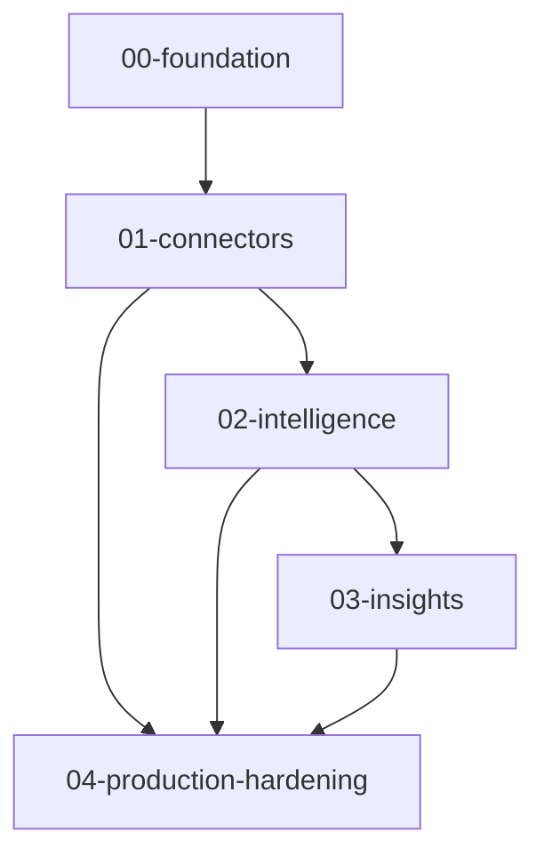

# Core platform specification

## 1. Overview

**Core** means shared capabilities that every business domain (marketing, finance, operations, agency) relies on: tenant isolation, configuration, connectors, agent analysis, and insight delivery.

**Relationship to business architecture:** Connectors ingest domain-specific data; intelligence layers produce cross-cutting verdicts and narratives; insights package outcomes for customers. `CompanyConfig` and adapter boundaries keep domain logic out of core code paths.

**Completion by sub-phase (high level):**

| Sub-phase                 | Status                                                          |
| ------------------------- | --------------------------------------------------------------- |
| `00-foundation`           | Largely complete; see `00-foundation/acceptance-criteria.md`    |
| `01-connectors`           | In progress; operations docs and adapters evolve with platforms |
| `02-intelligence`         | Planned / partial; see `02-intelligence/`                       |
| `03-insights`             | Planned / partial; see `03-insights/`                           |
| `04-production-hardening` | Planned; continuous hardening                                   |

## 2. Business domains

| Domain     | Primary connectors / sources (now or planned) | Notes                                          |
| ---------- | --------------------------------------------- | ---------------------------------------------- |
| Marketing  | Meta, GA4, GSC, GBP, TikTok                   | Normalized snapshots, adapter health           |
| Finance    | QuickBooks, Stripe (planned)                  | Same connector framework                       |
| Operations | Extensible `ConnectorAdapter`                 | Non-marketing sources                          |
| Agency     | Multi-tenant SaaS                             | Partner org isolation via tenant context + RLS |

**Cross-domain analysis:** Agent pipelines consume normalized snapshots regardless of vertical; templates and localization follow `CompanyConfig`.

## 3. Phase dependencies

- **Blocking:** Foundation before reliable connectors; connectors before production-grade intelligence inputs; intelligence before insight quality gates.
- **Parallel:** Hardening overlaps late connector and intelligence work; some insights scaffolding can proceed with mocked agent output.

## 4. Acceptance criteria summary

Aggregated definitions of done live per sub-phase in each `acceptance-criteria.md`. Track implementation status in `docs/architecture/implementation-guide.md` and `docs/00-overview/development-status-summary.md`.

---

Maintainer: Architecture Team · Last Updated: 2026-04-11
